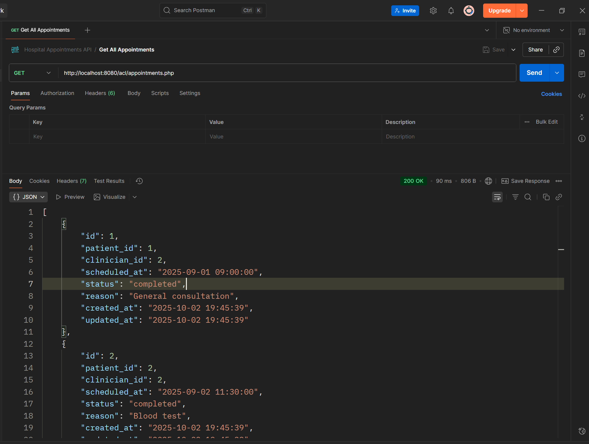
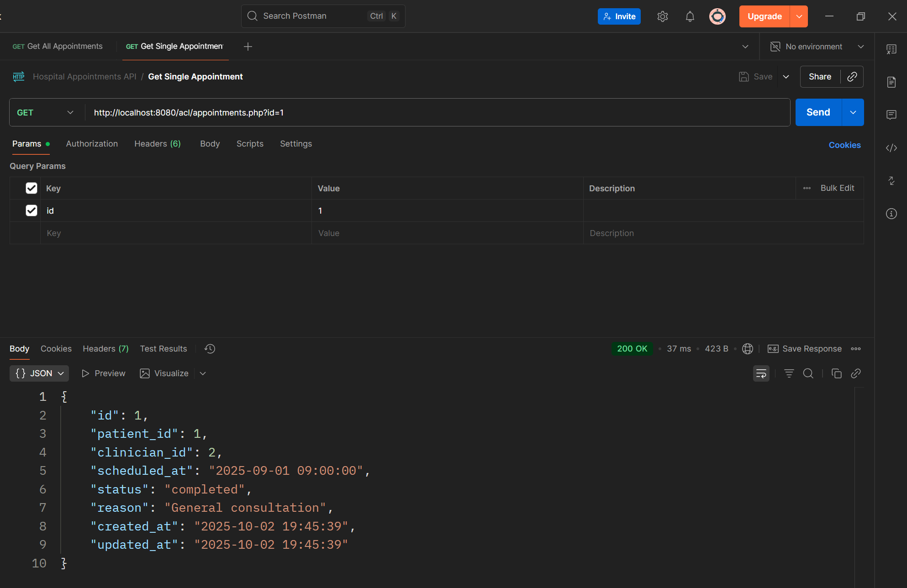
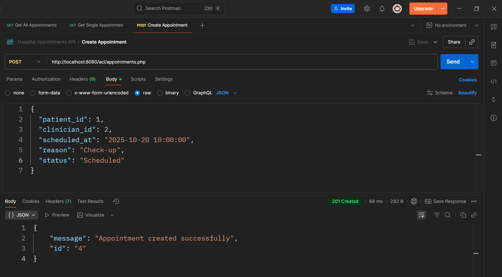
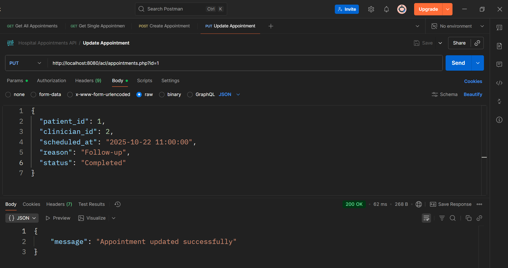
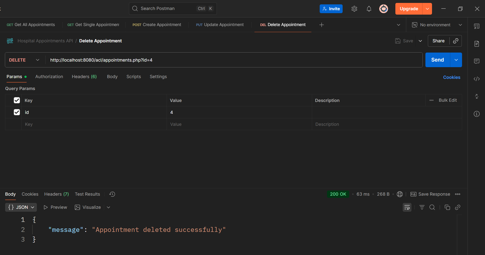
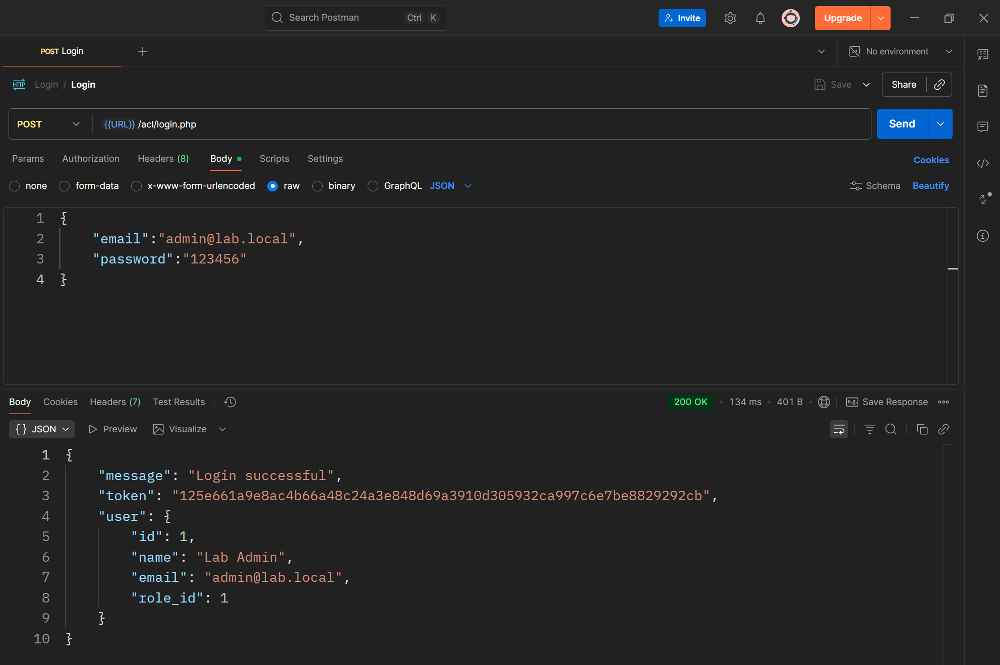
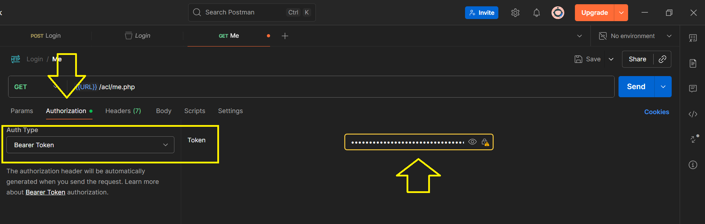
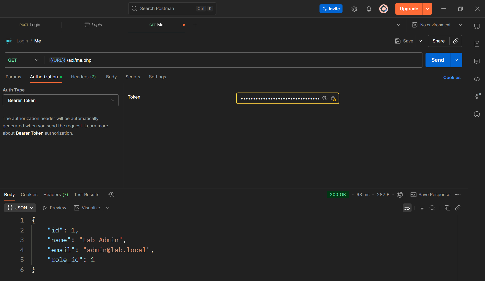
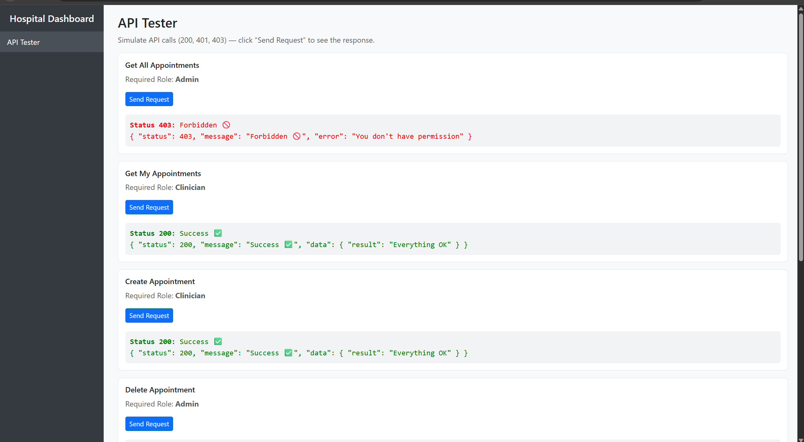

# Broken Access Control

## Introduction
### What is Broken Access Control?

Broken Access Control occurs when a system fails to correctly enforce who can access or perform which actions on resources. When access control is broken, an actor (authenticated or not) can view, modify, delete, or execute things they are not authorized to.

### Root causes
* Missing server-side checks — relying only on client-side UI restrictions.
* Inconsistent enforcement — some code paths validate permissions while others do not.
* Predictable or exposed object identifiers (sequential IDs, predictable filenames) enabling simple guessing.
* Overly broad default permissions or roles that grant more privileges than intended.
* Complex or fragmented authorization logic that omits edge cases.
* Automatic binding / mass assignment where incoming data is mapped directly to internal fields.
* Session/token scoping mistakes — tokens that aren’t limited in scope or lifetime.
* Hidden or debug functionality left enabled in production code.
* Trusting client-supplied data for authorization decisions.

### How attackers exploit it

* Parameter tampering — changing an identifier in a request (e.g., document_id=45 → document_id=46) to access another user’s resource.
* Direct object reference guessing (IDOR) — sequential or predictable IDs allow enumeration of resources.
* Mass assignment — sending extra fields (e.g., is_admin=true) that the server accepts and persists.
* Function-level access bypass — invoking privileged actions directly when only the UI prevented access.
* Token replay / token reuse — using another user’s session token where tokens are not scoped or revoked.
* Chaining operations — combining multiple allowed actions in a sequence to escalate privileges.
* Hidden endpoint discovery — calling endpoints or functions that exist but are not properly guarded.
* Client-side control manipulation — altering forms or scripts so that the client sends values that the server then trusts.

### Typical impacts

Unauthorized data disclosure (personal records, invoices, documents).
Unauthorized data modification (changing records, prices, or settings).
Privilege escalation (ordinary users gaining administrative capabilities).
Resource deletion or denial-of-service for legitimate users.
Legal, regulatory, and reputational consequences.

### Real-world scenarios

#### 1) Direct object reference exposure

* Setup: Resources are accessed by a simple identifier (e.g., /resource?id=123). The system returns the resource if the identifier exists but does not verify ownership.
* Exploit: An actor increments the identifier to 124 and receives another person’s document.
* Result: Confidential data is disclosed.

#### 2) Function-level access missing

* Setup: A privileged action (delete, approve, override) is available in the user interface only for certain roles, but the underlying function does not check roles.
* Exploit: Any authenticated user invokes the function directly and performs the privileged action.
* Result: Unauthorized modifications or deletions.

#### 3) Mass-assignment escalation

* Setup: Incoming data is bound automatically to a model. Critical fields (e.g., role, status, price) are not protected.
* Exploit: An actor includes role=admin or price=0 in their submission and the system saves it.
* Result: Privilege escalation or financial tampering.

#### 4) Predictable file paths or identifiers

* Setup: Files or documents are stored using predictable names like documents/user_1_report.pdf. Access checks are absent when fetching the file.
* Exploit: Changing the path to documents/user_2_report.pdf downloads someone else’s file.
* Result: Exposure of sensitive files.

#### 5) Token or session misuse

* Setup: Session tokens are long-lived and not scoped; there’s no revocation mechanism.
* Exploit: A leaked or intercepted token is used to perform actions under another user’s identity.
* Result: Account takeover and unauthorized actions.


## Mitigating Broken Access Control — ACLs (Roles, Permissions, Policies)

This section shows how to mitigate Broken Access Control by implementing a robust Access Control List (ACL) system. It explains the three levels (roles, permissions, policies), data model, enforcement points, examples, and practical advice for secure, testable access control.

### 1- Authentication vs Authorization (Before ACLs)

Before implementing Access Control Lists (ACLs), it’s essential to understand the difference between authentication and authorization:

* Authentication verifies who the user is — usually by checking credentials like email and password.
* Authorization defines what the authenticated user is allowed to do — for example, whether a doctor can view a patient’s file or update medical notes.

In secure systems, authentication always happens first, followed by authorization checks enforced through roles, permissions, and policies. Together, these form the foundation for preventing Broken Access Control vulnerabilities.

### 2- High-level principles (always follow)

* Deny by default. If you can’t prove a user has permission, deny the action.
* Server-side enforcement only. Never rely on client-side checks. All checks must run on the server (or service) that controls the resource.
* Least privilege. Give users the minimal set of permissions required.
* Centralize authorization logic. One consistent place to evaluate permissions reduces bugs.
* Separation of duties. Distinguish authentication (who you are) from authorization (what you can do).
* Fail-safe / explicit errors. On error, return a safe response (e.g., 403).
* Audit / logging. Record access decisions (allow/deny) for analysis and incident response.
* Test & review. Automated tests, fuzzing, and manual review for edge cases.

### 3 — ACL concepts explained (roles, permissions, policies)

**Roles** — named groupings representing job functions or user categories (e.g., admin, editor, viewer). Roles simplify management by bundling permissions.
**Permissions** — fine-grained actions the system understands, usually expressed as resource:action (e.g., document:read, appointment:cancel, billing:update).
**Policies** — rules that evaluate context and attributes beyond static role-permission mappings. Policies can include ownership, time windows, attributes, or resource-specific rules (e.g., “users can edit resources they own”, “clinicians can view tests for their assigned patients”, “only during working hours”).

Together they let you express:
* Role-based grants (RBAC): role -> permission
* Attribute-based constraints (ABAC / policies): permission allowed only if context conditions hold
* Per-resource overrides: ACL entries for specific objects (e.g., acl_entries(resource_type, resource_id, subject, permission))

### 4 — Recommended data model (SQL-ish)

A minimal but practical schema that supports roles, permissions, role assignments, direct permission grants, and resource-level ACLs:

```sql
-- Roles and permissions
CREATE TABLE roles (
  id INT PRIMARY KEY AUTO_INCREMENT,
  name VARCHAR(100) UNIQUE NOT NULL,
  description VARCHAR(255)
);

CREATE TABLE permissions (
  id INT PRIMARY KEY AUTO_INCREMENT,
  name VARCHAR(150) UNIQUE NOT NULL  -- e.g., "appointments:create", "patients:view"
);

CREATE TABLE role_permissions (
  role_id INT NOT NULL,
  permission_id INT NOT NULL,
  PRIMARY KEY (role_id, permission_id),
  FOREIGN KEY (role_id) REFERENCES roles(id) ON DELETE CASCADE,
  FOREIGN KEY (permission_id) REFERENCES permissions(id) ON DELETE CASCADE
);

-- User-role assignments
CREATE TABLE user_roles (
  user_id BIGINT NOT NULL,
  role_id INT NOT NULL,
  PRIMARY KEY (user_id, role_id),
  FOREIGN KEY (role_id) REFERENCES roles(id)
);

-- Optional: direct user permissions (overrides/exception)
CREATE TABLE user_permissions (
  user_id BIGINT NOT NULL,
  permission_id INT NOT NULL,
  allowed TINYINT(1) NOT NULL DEFAULT 1, -- 1 = allow, 0 = deny
  PRIMARY KEY (user_id, permission_id),
  FOREIGN KEY (permission_id) REFERENCES permissions(id)
);

-- Resource-level ACL (object-level)
CREATE TABLE resource_acl (
  id BIGINT AUTO_INCREMENT PRIMARY KEY,
  resource_type VARCHAR(100) NOT NULL,   -- e.g., "appointment", "file"
  resource_id VARCHAR(255) NOT NULL,     -- object identifier
  subject_type ENUM('user','role') NOT NULL,
  subject_id VARCHAR(255) NOT NULL,      -- user_id or role_id
  permission_id INT NOT NULL,
  allowed TINYINT(1) DEFAULT 1,
  FOREIGN KEY (permission_id) REFERENCES permissions(id)
);
```

**Notes:**

resource_id is a string so it handles UUIDs or composite keys.
Using both user_permissions and resource_acl allows exceptions and per-resource overrides.
The permissions table centralizes naming so code can check by name or ID.

### 5 — Permission naming conventions

Use hierarchical, descriptive permission names:
* resource:action [:scope]
* Examples: appointments:create, appointments:read, appointments:update, files:download, billing:adjust.
This helps map permissions to UI actions and audit logs.

### 6 — Authorization evaluation flow (recommended)

Design a single function (middleware/service) that answers a single question: “Is subject S allowed to perform ACTION A on RESOURCE R given CONTEXT C?”
Example algorithm:

1. Authenticate user → obtain user_id, roles[], session.
2. Fetch static grants:
   * Union permissions from roles -> role_permissions.
   * Add any user_permissions direct grants (explicit deny should override allow).
3. Check explicit resource-level ACLs in resource_acl for the specific resource_type + resource_id. If an explicit deny exists, return deny. If an explicit allow exists, tentatively allow but still run policies.
4. Check policy rules (ABAC):
   * Example checks: owner == user_id, user.department == resource.department, time_of_day allowed, appointment.clinician_id == user_id.
   * Policies can be code functions or declarative rules stored in DB (careful with complexity).
5. Combine results:
   * Explicit deny anywhere → deny.
   * Explicit allow from ACL or role + policy satisfied → allow.
   * Nothing matched → deny (deny-by-default).
6. Return true/false, and record decision (optionally).

#### Example enforcement middleware (PHP pseudocode)

Place this logic in a single, reusable function and call it at every protected endpoint or service boundary.

```php
function authorize($pdo, $userId, $permissionName, $resourceType = null, $resourceId = null, $context = []) {
    // 1) Load permission id
    $perm = $pdo->prepare("SELECT id FROM permissions WHERE name = ?");
    $perm->execute([$permissionName]);
    $permRow = $perm->fetch();
    if (!$permRow) return false; // unknown permission -> deny

    $permId = $permRow['id'];

    // 2) Check explicit resource ACL (highest priority for object-level control)
    if ($resourceType && $resourceId) {
        $acl = $pdo->prepare("SELECT allowed, subject_type, subject_id FROM resource_acl WHERE resource_type=? AND resource_id=? AND permission_id=? LIMIT 1");
        $acl->execute([$resourceType, $resourceId, $permId]);
        $aclRow = $acl->fetch();
        if ($aclRow) {
            // if subject applies to user or user's role (resolve role check outside)
            if ($aclRow['subject_type'] === 'user' && intval($aclRow['subject_id']) === intval($userId)) {
                return (bool)$aclRow['allowed'];
            }
            // role subject handling could be added here (check user's roles)
        }
    }

    // 3) User-specific permission overrides
    $up = $pdo->prepare("SELECT allowed FROM user_permissions WHERE user_id=? AND permission_id=?");
    $up->execute([$userId, $permId]);
    if ($upRow = $up->fetch()) {
        return (bool)$upRow['allowed'];
    }

    // 4) Role-based permissions
    $r = $pdo->prepare("
        SELECT 1 FROM role_permissions rp
        JOIN user_roles ur ON ur.role_id = rp.role_id
        WHERE ur.user_id = ? AND rp.permission_id = ? LIMIT 1
    ");
    $r->execute([$userId, $permId]);
    if (!$r->fetch()) {
        // user has no role grant -> deny by default
        return false;
    }

    // 5) Policy checks (example: ownership)
    // This is application-specific. Example: if permissionName ends with ':edit' and resource has owner_id
    if ($resourceType && $resourceId) {
        // example policy: allow if owner
        $ownerStmt = $pdo->prepare("SELECT owner_id FROM " . $resourceType . " WHERE id = ? LIMIT 1");
        $ownerStmt->execute([$resourceId]);
        if ($row = $ownerStmt->fetch()) {
            if ($row['owner_id'] == $userId) return true;
        }
    }

    // 6) No explicit deny and role has permission -> allow
    return true;
}
```

**Notes:**

* This is simplified; real implementation should handle role subjects in resource_acl, policy engine, caching, and performance.
* Policies often require fetching resource metadata (e.g., owner_id) — do it efficiently or cache.

#### Example: creating roles and permissions (SQL seed)

```sql
-- permissions
INSERT INTO permissions (name) VALUES
  ('appointments:create'),
  ('appointments:read'),
  ('appointments:update'),
  ('appointments:delete'),
  ('files:download');

-- roles
INSERT INTO roles (name) VALUES ('admin'), ('clinician'), ('receptionist');

-- grant clinician read/update appointments
INSERT INTO role_permissions (role_id, permission_id)
SELECT r.id, p.id FROM roles r, permissions p
WHERE r.name='clinician' AND p.name IN ('appointments:read','appointments:update');

-- admin gets everything (example)
INSERT INTO role_permissions (role_id, permission_id)
SELECT r.id, p.id FROM roles r, permissions p WHERE r.name='admin';
```


## Lab
### Introduction

In this lab, we will implement a secure RESTful API for a hospital management system. The goal is to design and develop backend services that handle sensitive healthcare operations—such as user authentication, appointment scheduling, and patient–clinician interactions—while applying best security practices to protect data integrity, confidentiality, and access control.

A REST API (Representational State Transfer Application Programming Interface) is an architectural style that allows different systems to communicate over the web using standard HTTP methods. REST APIs are widely used because they are stateless, scalable, and easy to integrate with both web and mobile applications.

The table below summarizes the most common HTTP methods (verbs) used in REST APIs and their purposes:

| **HTTP Method** | **Description**                     | **Typical Use Case**                                                      |
| --------------- | ----------------------------------- | ------------------------------------------------------------------------- |
| **GET**         | Retrieve data from the server.      | Get a list of appointments or details of a specific patient.              |
| **POST**        | Send new data to the server.        | Create a new user or schedule a new appointment.                          |
| **PUT**         | Update existing data on the server. | Modify a patient’s information or update appointment details.             |
| **DELETE**      | Remove data from the server.        | Delete an appointment or remove a user record.                            |
| **PATCH**       | Partially update existing data.     | Change only the appointment status (e.g., from “Pending” to “Confirmed”). |

In the following sections, we will begin implementing these operations step by step to build a complete and secure REST API for the hospital system.

### Lab Objective

The objective of this lab is to identify and fix Broken Access Control vulnerabilities in a hospital REST API.
You will learn how to:

* Implement role-based restrictions to prevent unauthorized actions.
* Secure endpoints so that only allowed users can access or modify specific data.
* Apply least privilege principles for all API operations.
* Test and verify access control rules to ensure data isolation between users.


### Setup

In this lab, we will continue using the same hospital database created in the [setup section](./setup.md).
All authentication, authorization, and access control mechanisms will be built on top of this existing data model, which already includes users, roles, patients, appointments, and related entities.

We will start by implementing user authentication through a secure login API, then progressively add authorization rules to protect sensitive endpoints such as patient records, medical notes, and billing information.

### Phase 1 — Implementing the Appointments REST API

#### Step 1 — Setting Up the Endpoint Structure

Create a new file called appointments.php inside your API folder.
This file will handle all CRUD (Create, Read, Update, Delete) operations related to appointments.
We’ll use the same db.php and utils.php files for database connection and JSON responses.

#### Step 2 — Handle HTTP Methods

Inside appointments.php, start by detecting the HTTP request method using $_SERVER['REQUEST_METHOD'].
Depending on the method, call the appropriate function:

* GET → Retrieve appointments
* POST → Create a new appointment
* PUT → Update an existing appointment
* DELETE → Remove an appointment

> Note: You can test the API using any HTTP client (e.g., curl, Insomnia, or browser plugins).
> In this lab, we will use Postman to send requests and verify the behavior of each endpoint.

#### Step 3 — Fetch Appointments (GET)

Write a SQL query to retrieve appointments along with their related patient and clinician details.
Use a JOIN between the appointments, patients, and users tables.
Return the result as JSON using your helper function.

**Example idea:**

* /api/appointments → returns all appointments
* /api/appointments?id=3 → returns details for appointment with ID 3

Code sample:
```php
        if (isset($_GET['id'])) {
            $stmt = $pdo->prepare("SELECT * FROM appointments WHERE id = ?");
            $stmt->execute([$_GET['id']]);
            $appointment = $stmt->fetch(PDO::FETCH_ASSOC);
            if (!$appointment) sendJson(["error" => "Appointment not found"], 404);
            sendJson($appointment);
        } else {
            $stmt = $pdo->query("SELECT * FROM appointments");
            sendJson($stmt->fetchAll(PDO::FETCH_ASSOC));
        }
```

Result for All :



Result for One :



#### Step 4 — Create a New Appointment (POST)

Read JSON input from php://input containing the appointment details such as:

* patient_id
* clinician_id
* scheduled_at
* reason

Then insert a new row into the appointments table.
Return a success message and the new appointment ID in JSON.

Code sample:
```php
        $input = json_decode(file_get_contents('php://input'), true);
        if (!$input || !isset($input['patient_id'], $input['clinician_id'], $input['date_time'], $input['reason'])) {
            sendJson(["error" => "Missing required fields"], 400);
        }

        $stmt = $pdo->prepare("
            INSERT INTO appointments (patient_id, clinician_id, date_time, reason, status)
            VALUES (?, ?, ?, ?, ?)
        ");
        $stmt->execute([
            $input['patient_id'],
            $input['clinician_id'],
            $input['date_time'],
            $input['reason'],
            $input['status'] ?? 'Scheduled'
        ]);

        sendJson(["message" => "Appointment created successfully", "id" => $pdo->lastInsertId()], 201);
```

Result : 


#### Step 5 — Update an Appointment (PUT)

Read the appointment id and updated fields (like status or reason) from the JSON request.
Execute an UPDATE query to modify the existing record.
Respond with confirmation that the appointment was updated.

Code sample:
```php
        if (!isset($_GET['id'])) 
            sendJson(["error" => "Missing appointment ID"], 400);
        $id = $_GET['id'];
        $input = json_decode(file_get_contents('php://input'), true);

        $stmt = $pdo->prepare("
            UPDATE appointments
            SET patient_id = ?, clinician_id = ?, date_time = ?, reason = ?, status = ?
            WHERE id = ?
        ");
        $stmt->execute([
            $input['patient_id'],
            $input['clinician_id'],
            $input['date_time'],
            $input['reason'],
            $input['status'],
            $id
        ]);

        sendJson(["message" => "Appointment updated successfully"]);
```

Result :


#### Step 6 — Delete an Appointment (DELETE)

Read the id parameter (e.g., /api/appointments?id=5)
Execute a DELETE query to remove that appointment.
Return a JSON message confirming deletion.

Code sample:
```php
if (!isset($_GET['id'])) sendJson(["error" => "Missing appointment ID"], 400);
        $stmt = $pdo->prepare("DELETE FROM appointments WHERE id = ?");
        $stmt->execute([$_GET['id']]);
        sendJson(["message" => "Appointment deleted successfully"]);
```

Result: 


#### Step 7 — Test the API

Use Postman or curl to test each operation:

* GET /api/appointments
* POST /api/appointments
* PUT /api/appointments
* DELETE /api/appointments

Make sure all CRUD operations work correctly before moving on to adding security controls in the next step.

### Phase 2 — Implementing User Authentication and the /me Endpoint

In this phase, we will implement a login API that allows users to authenticate using their email and password and receive an access token. We will also create a /me endpoint that returns information about the currently authenticated user.

This step lays the foundation for secure access control in the REST API by verifying users before allowing any sensitive operations.

### Step 1 — Login API

1. Create a file called login.php.
2. Accept POST requests with Basic Authentication headers (email:password).
3. Validate the user’s credentials against the users table using password_verify().
4. If credentials are correct, generate a session token and store it in the sessions table with:

* user_id
* session_token
* ip_address
* user_agent
* expires_at (e.g., 1 day from creation)

5. Return a JSON response containing:

* token — the access token
* user — basic user information (id, name, email, role_id)



#### Step 2 — /me Endpoint

1. Create a file called me.php.
2. Accept GET requests.
3. Read the access token from the Authorization: Bearer \<token\> header.
4. Verify the token exists in the sessions table and has not expired or been revoked.
5. Return the authenticated user’s information in JSON:

* id
* name
* email
* role_id

#### Step 3 — Testing

Use Postman to:

1. Send a POST request to /login.php with email/password.
2. Receive the access token in the response.
3. Use the token in the Authorization header for /me:

> Authorization: Bearer \<token\>
> 


5. Verify the response returns the correct user information.



### Phase 3 — Adding Authentication to Appointments API

In this phase, you will update the appointments REST API so that only logged-in users can access it. This ensures that all endpoints are protected by authentication, laying the foundation for secure access control.

#### Steps:

1. Require authentication for all endpoints

- At the top of appointments.php, read the token from the Authorization header:

    > Authorization: Bearer \<token\>
  
- Verify the token in the sessions table:

    - Must exist
    - Must not be expired
    - Must not be revoked

2. Block unauthenticated requests

- If the token is missing or invalid, return a 401 Unauthorized response in JSON.

3. Use authenticated user info

- Store the authenticated user details in a variable (e.g., $currentUser) to use later in your endpoints if needed.


#### Testing:

Use Postman:
1. Log in via /login.php to get a token.
2. Send requests to /appointments.php with the header:

    > Authorization: Bearer \<token\>

3. Requests without a token should fail with 401 Unauthorized.
4. Requests with a valid token should succeed.


### Phase 4 — Role-Based Access Control (Admin Only) for Appointments API


In this phase, you will enforce role-based access control (RBAC) on the appointments REST API. Only users with the admin role will be allowed to access certain endpoints (e.g., create, update, delete appointments), while other logged-in users can only view data if allowed.

This demonstrates how to combine authentication (Phase 3) with authorization to implement secure, controlled access.

#### Steps:

1. Determine the user’s role

* After authenticating the user using the Bearer token, fetch the user’s role_id and optionally the role name from the roles table.
* Store this info in a variable, e.g., $currentUserRole.

2. Restrict access based on role

* For endpoints like POST, PUT, DELETE in appointments.php, check if the user has the admin role:

```php
if ($currentUserRole !== 'admin') {
    sendJson(['error' => 'Forbidden: Admins only'], 403);
}
```

* Only allow users with the admin role to perform changes.
* GET requests may still be allowed for all authenticated users, depending on your design.

3. Return proper HTTP codes

* 403 Forbidden → user is authenticated but does not have the required role.
* 401 Unauthorized → user is not logged in (handled in Phase 3).


#### Testing:

Use Postman:

1. Log in as an admin user → get a token.
2. Log in as a non-admin user → get a token.
3. Test the endpoints:

* Admin token → should succeed for create/update/delete.
* Non-admin token → should return 403 Forbidden.

**Note:**

* This phase focuses on authorization by role.
* Combined with Phase 3 authentication, this ensures that only valid, properly authorized users can modify critical resources.

### Phase 5 — Permission-Based Access Control per Endpoint

What if we want to allow a user to view all appointments but not to create, update, or delete them?
Role-based access alone (like “admin” vs. “user”) may not be enough — we might need fine-grained permissions that control access per endpoint or action.

This phase introduces Permission-Based Access Control (PBAC) — where each API endpoint is associated with a specific permission.


#### Objective:

Enhance the access control system to:

* Define explicit permissions (e.g., view_appointments, create_appointments, update_appointments, delete_appointments).
* Assign permissions to roles (e.g., admin, doctor, user).
* Enforce these permissions at the API level for every request.


#### Steps:

1. Determine the user’s role
   - After authenticating the user using the Bearer token, fetch the user’s role_id and optionally the role name from the roles table.
   - Store this info in a variable, e.g., $currentUserRole.

2. Restrict access based on role
   - For endpoints like POST, PUT, DELETE in appointments.php, check if the user has the admin role:
```php
if ($currentUserRole !== 'admin') {
    sendJson(['error' => 'Forbidden: Admins only'], 403);
}
```
  - Only allow users with the admin role to perform changes.
  - GET requests may still be allowed for all authenticated users, depending on your design.

3. Return proper HTTP codes

   * 403 Forbidden → user is authenticated but does not have the required role.
   * 401 Unauthorized → user is not logged in (handled in Phase 3).

#### Testing:

Use Postman:
1. Log in as an admin user → get a token.
2. Log in as a non-admin user → get a token.
3. Test the endpoints:

   * Admin token → should succeed for create/update/delete.
   * Non-admin token → should return 403 Forbidden.


### Phase 5 — Policy-Based Access Control (PBAC)

In this phase, you will implement policy-based access control to refine authorization beyond simple roles.
While roles define who you are (e.g., admin, clinician), policies define what you can do under certain conditions.

This ensures fine-grained control, such as allowing clinicians to access only their own appointments, while admins can access all appointments.

#### Concept Overview
| **Access Type**           | **Description**                                                                             |
|---------------------------|---------------------------------------------------------------------------------------------|
| **Role/Permission-Based** | Access based on role or permission(e.g., only admins can manage data).                      |
| **Policy-Based**          | Access depends on specific conditions (e.g., clinicians can only modify their own records). |

#### Scenario in This Lab
You will implement two policy rules for the appointments API:

| **Action**                    | **Policy Rule**                                                                                                                           |
| ------------------------------ |-------------------------------------------------------------------------------------------------------------------------------------------|
| **GET \/appointments**          | - **Admins:** Can retrieve all appointments. - **Clinicians:** Can retrieve only their own appointments (\`WHERE clinician_id = user_id\`). |
| **PUT \/appointments\/\{id\}**     | - **Admins:** Can update any appointment. - **Clinicians:** Can update only appointments assigned to them.                                |
| **DELETE \/appointments\/\{id\}**  | - **Admins only.**                                                                                                                        |
| **POST \/appointments**         | - **Admins only (optional).**                                                                                                             |


#### Steps

1. Retrieve the authenticated user
   - From the session token, extract:
     - user_id
     - role (e.g., admin, clinician)

2. Implement policy logic
   - In each operation (GET, PUT, DELETE), apply conditional logic:

```php
if ($currentUserRole === 'admin') {
    // No restriction — full access
} elseif ($currentUserRole === 'clinician') {
    // Restrict to only their own appointments
    $query = "SELECT * FROM appointments WHERE clinician_id = :id";
} else {
    sendJson(['error' => 'Forbidden'], 403);
}
```

3. Update queries and checks
* For GET, filter the results by clinician_id if not admin.
* For PUT, check if the appointment belongs to the authenticated clinician before allowing the update:

```php
$stmt = $pdo->prepare("SELECT clinician_id FROM appointments WHERE id = :id");
$stmt->execute(['id' => $appointmentId]);
$appt = $stmt->fetch();

if ($currentUserRole !== 'admin' && $appt['clinician_id'] !== $currentUserId) {
    sendJson(['error' => 'Forbidden: You can only update your own appointments'], 403);
}
```
4. Return appropriate responses
* 403 Forbidden if the user violates a policy.
* 200 OK / 201 Created for valid actions.

#### Testing:

Use Postman to verify policy behavior:

| **User**                 | **Expected Behavior**                                   |
| ------------------------ | ------------------------------------------------------- |
| **Admin**                | Can get, create, update, delete any appointment.        |
| **Clinician**            | Can only view and update appointments assigned to them. |
| **Unauthorized User**    | Gets **401 Unauthorized**.                              |
| **Other Roles (if any)** | Gets **403 Forbidden**.                                 |


## Mini Project — Simple RBAC Dashboard (Final Instructions)

### Objective :
Build a small web platform (dashboard) that demonstrates authentication, role/permission/group management, and a frontend test-suite for API endpoints. The UI uses AJAX (jQuery) to call demo API endpoints and displays responses in a Swagger-like fashion.

### What you must do (concise)

1. Create the dashboard with a side menu and the following pages (5 pages total):

   - Page 1 — API Tester: Seven demo API endpoints. Each endpoint must be callable via AJAX (jQuery). Each endpoint should be able to return three canonical responses:
     - 200 OK (success message)
     - 401 Unauthorized (not logged in / invalid token)
   - 403 Forbidden (authenticated but insufficient permission)
   - Each endpoint is associated with a required role (e.g., admin, clinician, nurse, etc.). On the page show each endpoint with a short description, a button to call it, and a small area below that displays the JSON response and HTTP status (styled like Swagger responses).
   - Page 2 — Roles: A table listing roles (id, name, description).
   - Page 3 — Permissions: A table listing permissions (id, name, description).
   - Page 4 — Groups: A page where groups are listed and each group can be assigned a set of permissions (group → permissions). Explain that groups can be assigned to users as a convenience.
   - Page 5 — Users: A list of users. Clicking a user opens an edit view where you can toggle (switch buttons) that user’s assigned roles, permissions, and groups. Changes are saved via AJAX.

2. API behavior (backend): Implement minimal endpoints needed for the dashboard (authentication + endpoints that return the demo responses). For the demo endpoints on Page 1: each endpoint must simulate/return the three statuses (200 / 401 / 403) depending on the request context (e.g., missing token → 401, token present but wrong role → 403, token + role OK → 200). The UI should be able to trigger each scenario naturally (by sending/omitting a token or using tokens for different role accounts).

3. Frontend requirements:

   * Use jQuery AJAX to call the APIs and show results.
   * For each demo endpoint show: endpoint name, required role, a “Call” button, result JSON area, and HTTP status (200/401/403) with clear styling.
   * The display should be compact and user-friendly (Swagger-like response area under each endpoint).
   * Use toggles/switches on the Users edit page for assigning roles/permissions/groups.

4. UX notes: Keep the UI simple and clear — no need for fancy styling. The important part is functionality: buttons that call APIs and visible responses, and a straightforward CRUD interface for roles/permissions/groups/users.

### Testing (what to include in your submission)

* Demonstrate the three response scenarios for each of the 7 endpoints (200 / 401 / 403). Capture screenshots showing:
* Endpoint called successfully (200).
* Endpoint returning 401 (no token).
* Endpoint returning 403 (token but insufficient role).
* Show screenshots of: Roles page, Permissions page, Groups page (with group → permission assignment), Users page and a user-edit view with switches for role/permission/group.

### Submission (single PDF only)

Create **one** PDF file and submit it via the Google Form link below (demo — replace later):  
**https://docs.google.com/forms/d/e/1FAIpQLSfy5WQdFYPU28b84C4wR7wW4SyCi_1S6q9KRgrHi1Sj3vLQwA/viewform?usp=header**

### Demo 





