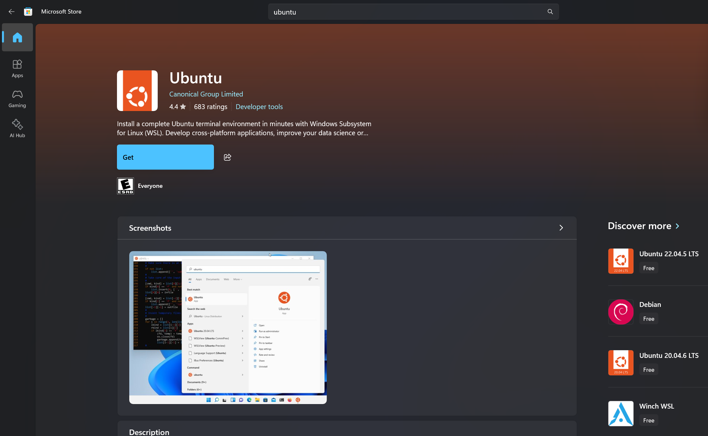

# 🛠️ Setup Guide for Security Labs

## Introduction

Before starting our security labs, it’s essential to create a **safe and isolated environment**. Security labs often involve intentionally vulnerable applications, so we must ensure everything runs in a **controlled space**, without risking our personal systems or networks.

This is where **virtualization** comes in.

### What is Virtualization?

Virtualization allows you to run multiple operating systems or applications on a single physical machine in an **isolated manner**. It enables the creation of virtual machines (VMs) or containers that behave like independent computers.

### Why Use Virtualization in Security Labs?

- **Isolation:** Each lab runs in a controlled environment, minimizing risk to your host machine.
- **Reproducibility:** Quickly reset environments if something goes wrong.
- **Flexibility:** Run multiple operating systems and applications without interfering with your main system.
- **Safety:** Vulnerabilities and attacks remain contained.

---

## Types of Virtualization

There are two main approaches we can use in our labs:

### 1. Virtual Machines (VMs)

- Emulates a full operating system (e.g., Ubuntu running inside Windows).
- Examples: VirtualBox, VMware, Hyper-V.
- Each VM has its own virtual hardware (CPU, memory, disk).
- Full isolation but resource-heavy.

### 2. Containers

- Lightweight and share the host’s operating system kernel.
- Faster startup and lower resource usage.
- Common tool: Docker.
- Ideal for spinning up databases, web apps, and vulnerable lab environments quickly.

---

## What We’ll Use in Our Labs

For our labs, we will use **containers** (with Docker) to build our home lab environment, which includes:

- **MySQL** (database)
- **phpMyAdmin** (database management)
- **PHP environment** (demo hospital application)

Since Docker works best on **Linux**, Windows users will need a Linux environment first. There are two options:

1. **Using a Linux VM**
    - Install a full Linux virtual machine (Ubuntu recommended).
    - If you choose this option, you can find detailed installation guides here:  
      [DevOps Course Repo](https://github.com/mehdiaitsaid/devops-course)

2. **Using WSL (Windows Subsystem for Linux)**
    - WSL allows running Linux directly on Windows without a full VM.
    - It is lighter and easier to set up than a VM.
    - The following sections will guide you through installing WSL and preparing it for Docker.

---


WSL allows you to run a full Linux environment directly on Windows without the overhead of a traditional virtual machine. For our security labs, WSL provides a lightweight Linux environment to run Docker and containers.

> ⚠️ Before installing Ubuntu from the Microsoft Store, you must **enable WSL** via Windows Features:
> 1. Open **Control Panel → Programs → Turn Windows features on or off**.
> 2. Check **Windows Subsystem for Linux**.
> 3. Optionally, also check **Virtual Machine Platform** for WSL 2.
> 4. Click **OK** and restart your computer if prompted.


> 5. Check the installation


### Step 1: Open Microsoft Store

1. Click the **Start menu** and search for **Microsoft Store**.
2. Open the Microsoft Store app.


---

### Step 2: Search for Ubuntu

1. In the search bar, type **Ubuntu**.
2. Select the latest **Ubuntu LTS** version (recommended for stability, e.g., Ubuntu 22.04 LTS).


---

### Step 3: Install Ubuntu

1. Click the **Install** button.
2. Wait for the installation to complete (this may take a few minutes depending on your internet speed).



---

### Step 4: Launch Ubuntu

1. Once installed, click **Launch** in the Microsoft Store or open Ubuntu from the Start menu.
2. On the first launch, the terminal will initialize the Linux environment.
3. You will be prompted to create a **Linux username and password**.


---

### Step 5: Verify Installation

1. The Ubuntu terminal should now be ready. You can check the Linux kernel version by typing:

```bash
uname -a
```

2. You should see output similar to:

```bash
Linux DESKTOP-XXXXX 5.15.90.1-microsoft-standard-WSL2 #1 SMP ...
```

Optionally, update your package lists:

```bash
sudo apt update && sudo apt upgrade -y
```


## Installing Docker on Ubuntu

### Step 1 — Update Packages

Update your existing list of packages:

```bash
sudo apt update
```

### Step 2 — Install Prerequisite Packages

```bash
sudo apt install apt-transport-https ca-certificates curl software-properties-common
```

### Step 3 — Add Docker GPG Key

```bash
curl -fsSL https://download.docker.com/linux/ubuntu/gpg | sudo gpg --dearmor -o /usr/share/keyrings/docker-archive-keyring.gpg
```

### Step 4 — Add Docker Repository

```bash
echo "deb [arch=$(dpkg --print-architecture) signed-by=/usr/share/keyrings/docker-archive-keyring.gpg] https://download.docker.com/linux/ubuntu $(lsb_release -cs) stable" | sudo tee /etc/apt/sources.list.d/docker.list > /dev/null
```

### Step 5 — Update Package List Again

Update your package list to include the new Docker repository:

```bash
sudo apt update
```

### Step 6 — Install Docker

```bash
sudo apt install docker-ce
```


### Step 7 — Verify Docker Installation

```bash
sudo systemctl status docker
```
You should see output similar to:


### Install Docker Compose

Docker Compose is a tool for defining and managing **multi-container Docker applications** using a single YAML file (`docker-compose.yml`). It simplifies running, configuring, and linking multiple containers as a single service.

To install Docker Compose on Ubuntu:

```bash
sudo apt install docker-compose -y
```

# 🏥 Hospital Demo Lab Setup

This guide will walk you through creating a **PHP demo application**, setting up **Docker + Docker Compose**, and running the full environment including MySQL and phpMyAdmin.

---

## 1. Create the Project Directory

Create a folder for your project:

```bash
mkdir hospital-lab
cd hospital-lab
```

Inside this folder, create a src/ directory for your PHP source code:
```bash
mkdir src
```

## 2. Create the PHP Index File

Create a file index.php inside src/:

```php
<?php

// Database connection parameters
$host = 'mysql_db'; 
$dbname = 'your_database_name';
$username = 'your_username';
$password = 'your_password';

try {
    // Create a new PDO instance
    $pdo = new PDO("mysql:host=$host;dbname=$dbname", $username, $password);

    // Set PDO error mode to exception
    $pdo->setAttribute(PDO::ATTR_ERRMODE, PDO::ERRMODE_EXCEPTION);

    echo "Database connection successful!";
} catch (PDOException $e) {
    // Catch any PDO exceptions and display an error message
    echo "Database connection failed: " . $e->getMessage();
}

?>
```
This will be the landing page for the demo application and test the connection with the database


## 3. Create the PHP Dockerfile

In the project root (same level as src/), create a file named Dockerfile with the following content:

```dockerfile
# Use official PHP with Apache
FROM php:8.2-apache

# Install necessary PHP extensions and cleanup
RUN apt-get update && \
    apt-get install -y libzip-dev libicu-dev && \
    docker-php-ext-install pdo pdo_mysql mysqli opcache intl zip && \
    apt-get clean && \
    rm -rf /var/lib/apt/lists/*

# Copy application source into the container
COPY src/ /var/www/html/

# Set working directory
WORKDIR /var/www/html/

# Expose port 80 for web access
EXPOSE 80
```

## 4. Create the .env File

Create a .env file in the project root with the following content:

```dotenv
# MySQL configuration
MYSQL_ROOT_PASSWORD=root_pwd
MYSQL_DATABASE=app_db
MYSQL_USER=db_user
MYSQL_PASSWORD=db_user_pwd

# phpMyAdmin configuration
PMA_HOST=db
PMA_PORT=3306
PMA_ARBITRARY=1

# Ports
DB_PORT=3306
PHPMYADMIN_PORT=8081
```
> This file allows Docker Compose to read configuration variables for MySQL and phpMyAdmin.

## 5. Create the docker-compose.yml File

In the project root, create docker-compose.yml:


```yaml
services:
  # The Database Service
  mysql_db:
    image: mysql:latest
    container_name: mysql_db
    environment:
      MYSQL_ROOT_PASSWORD: ${MYSQL_ROOT_PASSWORD}
      MYSQL_DATABASE: ${MYSQL_DATABASE}
      MYSQL_USER: ${MYSQL_USER}
      MYSQL_PASSWORD: ${MYSQL_PASSWORD}
    ports:
      - "${DB_PORT}:3306"
    volumes:
      - dbdata:/var/lib/mysql

  # The PHP Application Service
  app:
    # Use 'build' to tell Docker Compose to look for the Dockerfile in the current directory
    build: .
    container_name: php_app
    ports:
      - "8080:80" # Maps host port 80 to container port 80
    # Links the 'app' container to the 'db' container
    depends_on:
      - mysql_db
    # Mounts your local 'src' directory into the container's web root.
    # This allows you to modify code on your host machine and see changes instantly.
    volumes:
      - ./src/:/var/www/html/

  # The phpMyAdmin Service
  phpmyadmin:
    image: phpmyadmin/phpmyadmin
    container_name: pma
    # The 'links' directive is legacy; 'depends_on' is preferred for ordering.
    # The database connection still works via the hostname 'db'.
    depends_on:
      - mysql_db
    environment:
      # Use the service name 'db' as the host, not PMA_HOST
      PMA_HOST: mysql_db 
      PMA_PORT: 3306 # The internal port of the db service
      PMA_ARBITRARY: ${PMA_ARBITRARY}
    restart: always
    ports:
      - "${PHPMYADMIN_PORT}:80"

volumes:
  dbdata:
```

### 6. Launch the Environment

Run Docker Compose from the project root:
```bash
docker-compose up -d
```
* -d runs the containers in detached mode.
* Docker will build the PHP image, pull MySQL and phpMyAdmin images, and start all services.

## 7. Verify the Setup

PHP demo app: Open http://localhost:8080
in your browser. You should see:

> Welcome to the Hospital Demo App


phpMyAdmin: Open http://localhost:8080
(or your PHPMYADMIN_PORT). Login with:

* Server: mysql_db
* Username: root or user
* Password: from .env file

## 8. Stop and Clean Up

Stop all containers:
```bash
docker-compose down
```

Remove containers, networks, and volumes (if you want a fresh start):
```bash
docker-compose down -v
```

## 9. Create the database and dummy data for testing

```sql
CREATE DATABASE IF NOT EXISTS hospital_emr CHARACTER SET utf8mb4 COLLATE utf8mb4_unicode_ci;
USE hospital_emr;

CREATE TABLE roles (
                       id INT UNSIGNED AUTO_INCREMENT PRIMARY KEY,
                       name VARCHAR(50) NOT NULL UNIQUE,
                       description VARCHAR(255),
                       created_at TIMESTAMP DEFAULT CURRENT_TIMESTAMP
) ENGINE=InnoDB DEFAULT CHARSET=utf8mb4 COLLATE=utf8mb4_unicode_ci;

CREATE TABLE users (
                       id BIGINT UNSIGNED AUTO_INCREMENT PRIMARY KEY,
                       role_id INT UNSIGNED,
                       email VARCHAR(255) NOT NULL UNIQUE,
                       password_hash VARCHAR(255) NOT NULL,
                       full_name VARCHAR(255) NOT NULL,
                       phone VARCHAR(50),
                       is_active TINYINT(1) DEFAULT 1,
                       created_at TIMESTAMP DEFAULT CURRENT_TIMESTAMP,
                       updated_at TIMESTAMP NULL DEFAULT NULL ON UPDATE CURRENT_TIMESTAMP,
                       FOREIGN KEY (role_id) REFERENCES roles(id) ON DELETE SET NULL
) ENGINE=InnoDB DEFAULT CHARSET=utf8mb4 COLLATE=utf8mb4_unicode_ci;

CREATE TABLE patients (
                          id BIGINT UNSIGNED AUTO_INCREMENT PRIMARY KEY,
                          medical_record_number VARCHAR(100) NOT NULL UNIQUE,
                          first_name VARCHAR(150) NOT NULL,
                          last_name VARCHAR(150) NOT NULL,
                          dob DATE,
                          gender ENUM('male','female','other') DEFAULT 'other',
                          phone VARCHAR(50),
                          email VARCHAR(255),
                          address TEXT,
                          emergency_contact_name VARCHAR(255),
                          emergency_contact_phone VARCHAR(50),
                          created_at TIMESTAMP DEFAULT CURRENT_TIMESTAMP,
                          updated_at TIMESTAMP NULL DEFAULT NULL ON UPDATE CURRENT_TIMESTAMP
) ENGINE=InnoDB DEFAULT CHARSET=utf8mb4 COLLATE=utf8mb4_unicode_ci;

CREATE TABLE appointments (
                              id BIGINT UNSIGNED AUTO_INCREMENT PRIMARY KEY,
                              patient_id BIGINT UNSIGNED NOT NULL,
                              clinician_id BIGINT UNSIGNED,
                              scheduled_at DATETIME NOT NULL,
                              status ENUM('scheduled','cancelled','completed','no_show') DEFAULT 'scheduled',
                              reason VARCHAR(255),
                              created_at TIMESTAMP DEFAULT CURRENT_TIMESTAMP,
                              updated_at TIMESTAMP NULL DEFAULT NULL ON UPDATE CURRENT_TIMESTAMP,
                              FOREIGN KEY (patient_id) REFERENCES patients(id) ON DELETE CASCADE,
                              FOREIGN KEY (clinician_id) REFERENCES users(id) ON DELETE SET NULL,
                              INDEX (patient_id),
                              INDEX (clinician_id),
                              INDEX (scheduled_at)
) ENGINE=InnoDB DEFAULT CHARSET=utf8mb4 COLLATE=utf8mb4_unicode_ci;

CREATE TABLE medical_notes (
                               id BIGINT UNSIGNED AUTO_INCREMENT PRIMARY KEY,
                               patient_id BIGINT UNSIGNED NOT NULL,
                               author_id BIGINT UNSIGNED NOT NULL,
                               appointment_id BIGINT UNSIGNED,
                               note_text MEDIUMTEXT NOT NULL,
                               note_type VARCHAR(100),
                               created_at TIMESTAMP DEFAULT CURRENT_TIMESTAMP,
                               updated_at TIMESTAMP NULL DEFAULT NULL ON UPDATE CURRENT_TIMESTAMP,
                               FOREIGN KEY (patient_id) REFERENCES patients(id) ON DELETE CASCADE,
                               FOREIGN KEY (author_id) REFERENCES users(id) ON DELETE CASCADE,
                               FOREIGN KEY (appointment_id) REFERENCES appointments(id) ON DELETE SET NULL,
                               FULLTEXT KEY ft_note_text (note_text(1000))
) ENGINE=InnoDB DEFAULT CHARSET=utf8mb4 COLLATE=utf8mb4_unicode_ci;

CREATE TABLE lab_results (
                             id BIGINT UNSIGNED AUTO_INCREMENT PRIMARY KEY,
                             patient_id BIGINT UNSIGNED NOT NULL,
                             ordered_by_id BIGINT UNSIGNED,
                             performed_by_id BIGINT UNSIGNED,
                             appointment_id BIGINT UNSIGNED,
                             test_code VARCHAR(100) NOT NULL,
                             result_text MEDIUMTEXT,
                             result_value VARCHAR(255),
                             result_unit VARCHAR(50),
                             status ENUM('ordered','in_progress','completed','amended','cancelled') DEFAULT 'ordered',
                             recorded_at TIMESTAMP NULL,
                             created_at TIMESTAMP DEFAULT CURRENT_TIMESTAMP,
                             updated_at TIMESTAMP NULL DEFAULT NULL ON UPDATE CURRENT_TIMESTAMP,
                             FOREIGN KEY (patient_id) REFERENCES patients(id) ON DELETE CASCADE,
                             FOREIGN KEY (ordered_by_id) REFERENCES users(id) ON DELETE SET NULL,
                             FOREIGN KEY (performed_by_id) REFERENCES users(id) ON DELETE SET NULL,
                             FOREIGN KEY (appointment_id) REFERENCES appointments(id) ON DELETE SET NULL,
                             INDEX (patient_id),
                             INDEX (test_code),
                             INDEX (status)
) ENGINE=InnoDB DEFAULT CHARSET=utf8mb4 COLLATE=utf8mb4_unicode_ci;

CREATE TABLE billing (
                         id BIGINT UNSIGNED AUTO_INCREMENT PRIMARY KEY,
                         patient_id BIGINT UNSIGNED NOT NULL,
                         appointment_id BIGINT UNSIGNED,
                         amount DECIMAL(12,2) NOT NULL DEFAULT 0.00,
                         currency VARCHAR(10) DEFAULT 'USD',
                         status ENUM('pending','paid','cancelled','adjusted') DEFAULT 'pending',
                         description VARCHAR(512),
                         created_at TIMESTAMP DEFAULT CURRENT_TIMESTAMP,
                         updated_at TIMESTAMP NULL DEFAULT NULL ON UPDATE CURRENT_TIMESTAMP,
                         FOREIGN KEY (patient_id) REFERENCES patients(id) ON DELETE CASCADE,
                         FOREIGN KEY (appointment_id) REFERENCES appointments(id) ON DELETE SET NULL,
                         INDEX (patient_id),
                         INDEX (status)
) ENGINE=InnoDB DEFAULT CHARSET=utf8mb4 COLLATE=utf8mb4_unicode_ci;

CREATE TABLE files (
                       id BIGINT UNSIGNED AUTO_INCREMENT PRIMARY KEY,
                       patient_id BIGINT UNSIGNED,
                       uploaded_by_id BIGINT UNSIGNED,
                       appointment_id BIGINT UNSIGNED,
                       filename VARCHAR(512) NOT NULL,
                       mime_type VARCHAR(255),
                       file_size BIGINT UNSIGNED,
                       storage_path VARCHAR(1024),
                       checksum VARCHAR(128),
                       created_at TIMESTAMP DEFAULT CURRENT_TIMESTAMP,
                       FOREIGN KEY (patient_id) REFERENCES patients(id) ON DELETE SET NULL,
                       FOREIGN KEY (uploaded_by_id) REFERENCES users(id) ON DELETE SET NULL,
                       FOREIGN KEY (appointment_id) REFERENCES appointments(id) ON DELETE SET NULL,
                       INDEX (patient_id),
                       INDEX (uploaded_by_id)
) ENGINE=InnoDB DEFAULT CHARSET=utf8mb4 COLLATE=utf8mb4_unicode_ci;

CREATE TABLE audit_logs (
                            id BIGINT UNSIGNED AUTO_INCREMENT PRIMARY KEY,
                            user_id BIGINT UNSIGNED,
                            patient_id BIGINT UNSIGNED,
                            action VARCHAR(100) NOT NULL,
                            object_type VARCHAR(100),
                            object_id VARCHAR(255),
                            details JSON,
                            ip_address VARCHAR(45),
                            user_agent VARCHAR(512),
                            created_at TIMESTAMP DEFAULT CURRENT_TIMESTAMP,
                            FOREIGN KEY (user_id) REFERENCES users(id) ON DELETE SET NULL,
                            FOREIGN KEY (patient_id) REFERENCES patients(id) ON DELETE SET NULL,
                            INDEX (user_id),
                            INDEX (patient_id),
                            INDEX (action),
                            INDEX (created_at)
) ENGINE=InnoDB DEFAULT CHARSET=utf8mb4 COLLATE=utf8mb4_unicode_ci;

CREATE TABLE sessions (
                          id BIGINT UNSIGNED AUTO_INCREMENT PRIMARY KEY,
                          user_id BIGINT UNSIGNED NOT NULL,
                          session_token CHAR(128) NOT NULL UNIQUE,
                          ip_address VARCHAR(45),
                          user_agent VARCHAR(512),
                          created_at TIMESTAMP DEFAULT CURRENT_TIMESTAMP,
                          expires_at TIMESTAMP NULL,
                          revoked TINYINT(1) DEFAULT 0,
                          FOREIGN KEY (user_id) REFERENCES users(id) ON DELETE CASCADE,
                          INDEX (user_id),
                          INDEX (expires_at)
) ENGINE=InnoDB DEFAULT CHARSET=utf8mb4 COLLATE=utf8mb4_unicode_ci;


INSERT INTO roles (name, description, created_at) VALUES
                                                      ('admin', 'Administrator', NOW()),
                                                      ('doctor', 'Doctor', NOW()),
                                                      ('nurse', 'Nurse', NOW());

INSERT INTO users (role_id, email, password_hash, full_name, phone, is_active, created_at, updated_at) VALUES
                                                                                                           (1, 'admin@lab.local
', '$2y$10$ABCDEFGHexamplehashadmin1234567890', 'Lab Admin', '+212600000001', 1, NOW(), NOW()),
                                                                                                           (2, 'doc.alice@lab.local
', '$2y$10$ABCDEFGHexamplehashdoc1234567890', 'Dr. Alice', '+212600000002', 1, NOW(), NOW()),
                                                                                                           (3, 'nurse.bob@lab.local
', '$2y$10$ABCDEFGHexamplehashnurse123456789', 'Nurse Bob', '+212600000003', 1, NOW(), NOW());

INSERT INTO patients (medical_record_number, first_name, last_name, dob, gender, phone, email, address, emergency_contact_name, emergency_contact_phone, created_at, updated_at) VALUES
                                                                                                                                                                                     ('MRN0001','John','Doe','1980-01-01','male','+212610000001','john.doe@example.local
','123 Main St, City','Jane Doe','+212610000009', NOW(), NOW()),
                                                                                                                                                                                     ('MRN0002','Jane','Smith','1990-05-05','female','+212610000002','jane.smith@example.local
','45 Oak Ave, City','John Smith','+212610000010', NOW(), NOW()),
                                                                                                                                                                                     ('MRN0003','Sam','Brown','1975-07-20','male','+212610000003','sam.brown@example.local
','78 Pine Rd, City','Sara Brown','+212610000011', NOW(), NOW());

INSERT INTO appointments (patient_id, clinician_id, scheduled_at, status, reason, created_at, updated_at) VALUES
                                                                                                              (1, 2, '2025-09-01 09:00:00', 'completed', 'General consultation', NOW(), NOW()),
                                                                                                              (2, 2, '2025-09-02 11:30:00', 'completed', 'Blood test', NOW(), NOW()),
                                                                                                              (3, 3, '2025-09-03 14:00:00', 'scheduled', 'Follow-up', NOW(), NOW());

INSERT INTO medical_notes (patient_id, author_id, appointment_id, note_text, note_type, created_at, updated_at) VALUES
                                                                                                                    (1, 2, 1, 'Patient reports mild headache for 2 days. Vitals stable. Recommending paracetamol and rest.', 'consultation', NOW(), NOW()),
                                                                                                                    (2, 2, 2, 'Ordered CBC and lipid panel. Awaiting results.', 'order', NOW(), NOW()),
                                                                                                                    (3, 3, 3, 'Follow-up scheduled. Check wound healing and vitals.', 'followup', NOW(), NOW());

INSERT INTO lab_results (patient_id, ordered_by_id, performed_by_id, appointment_id, test_code, result_text, result_value, result_unit, status, recorded_at, created_at, updated_at) VALUES
                                                                                                                                                                                         (2, 2, 3, 2, 'CBC-001', 'CBC normal. WBC: 6.2, RBC: 4.7', 'WBC=6.2;RBC=4.7', '', 'completed', NOW(), NOW(), NOW()),
                                                                                                                                                                                         (1, 2, 3, 1, 'GLU-001', 'Fasting glucose 95 mg/dL', '95', 'mg/dL', 'completed', NOW(), NOW(), NOW());

INSERT INTO billing (patient_id, appointment_id, amount, currency, status, description, created_at, updated_at) VALUES
                                                                                                                    (1, 1, 150.00, 'USD', 'pending', 'Consultation fee', NOW(), NOW()),
                                                                                                                    (2, 2, 250.00, 'USD', 'paid', 'Blood test and lab fees', NOW(), NOW()),
                                                                                                                    (3, 3, 75.00, 'USD', 'pending', 'Follow-up visit', NOW(), NOW());

INSERT INTO files (patient_id, uploaded_by_id, appointment_id, filename, mime_type, file_size, storage_path, checksum, created_at) VALUES
                                                                                                                                       (1, 2, 1, 'xray_john_doe_20250901.pdf', 'application/pdf', 245678, '/storage/patient_1/xray_john_doe_20250901.pdf', 'sha256:examplechecksum1', NOW()),
                                                                                                                                       (2, 3, 2, 'cbc_result_jane_20250902.pdf', 'application/pdf', 123456, '/storage/patient_2/cbc_result_jane_20250902.pdf', 'sha256:examplechecksum2', NOW());

INSERT INTO audit_logs (user_id, patient_id, action, object_type, object_id, details, ip_address, user_agent, created_at) VALUES
                                                                                                                              (2, 1, 'view_patient', 'patient', '1', JSON_OBJECT('note','Viewed patient record from web UI'), '127.0.0.1', 'Mozilla/5.0 (lab)', NOW()),
                                                                                                                              (2, 2, 'view_billing', 'billing', '2', JSON_OBJECT('note','Viewed billing record for patient 2'), '127.0.0.1', 'Mozilla/5.0 (lab)', NOW());

INSERT INTO sessions (user_id, session_token, ip_address, user_agent, created_at, expires_at, revoked) VALUES
                                                                                                           (2, 'sessiontoken_example_doc_alice_1', '127.0.0.1', 'Mozilla/5.0 (lab)', NOW(), DATE_ADD(NOW(), INTERVAL 2 HOUR), 0),
                                                                                                           (1, 'sessiontoken_example_admin_1', '127.0.0.1', 'Mozilla/5.0 (lab)', NOW(), DATE_ADD(NOW(), INTERVAL 2 HOUR), 0);
```
